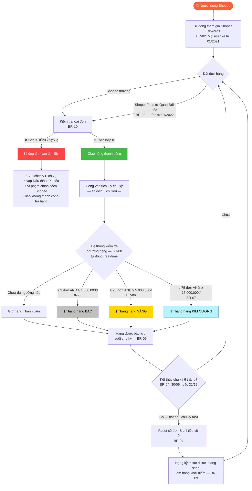
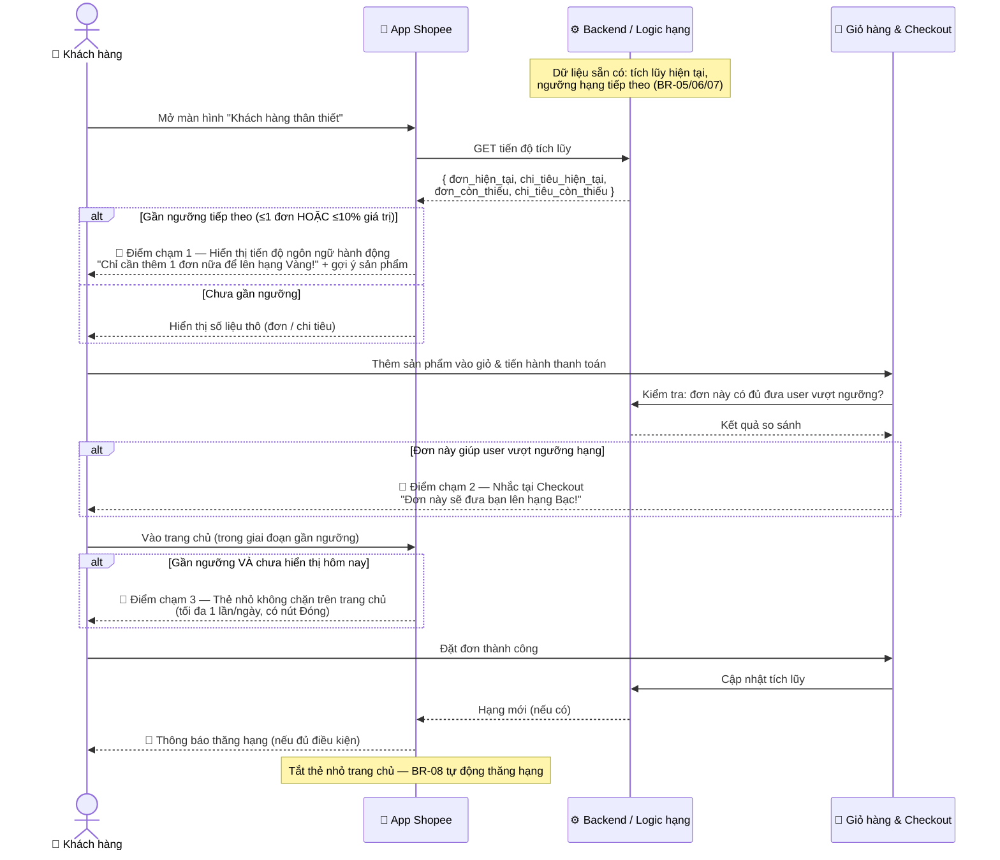
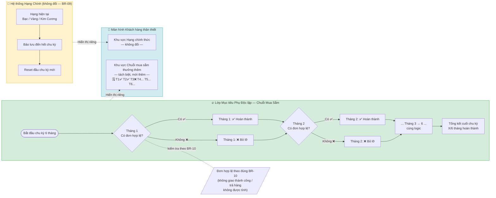

# Sơ đồ Quy trình — Shopee Rewards

## 1. Quy trình Tích lũy & Xét hạng (BR-01 → BR-10)

<b>Xem mã nguồn Mermaid</b>

---

## 2. Quy trình Nhắc Ngưỡng Hạng — Giải pháp PP-09

<b>Xem mã nguồn Mermaid</b>

---

## 3. Quy trình Chuỗi Mua Sắm Thưởng Thêm — Giải pháp PP-10

<b>Xem mã nguồn Mermaid</b>

---

> **Ghi chú nguồn:**
> - BR-05, BR-06: điều kiện AND/OR còn **xung đột nguồn** (chưa giải quyết). Sơ đồ dùng AND theo xác nhận nhân viên hỗ trợ Shopee.
> - BR-07: AND — nhất quán mọi nguồn, độ tin cậy Cao.
> - BR-08: thăng hạng tự động, không cần thao tác người dùng.
> - PP-09 & PP-10: giải pháp đề xuất, chưa triển khai — không thay đổi BR-01 đến BR-09.
