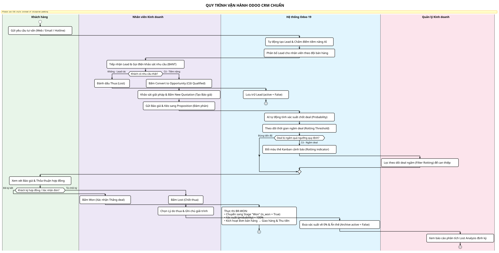
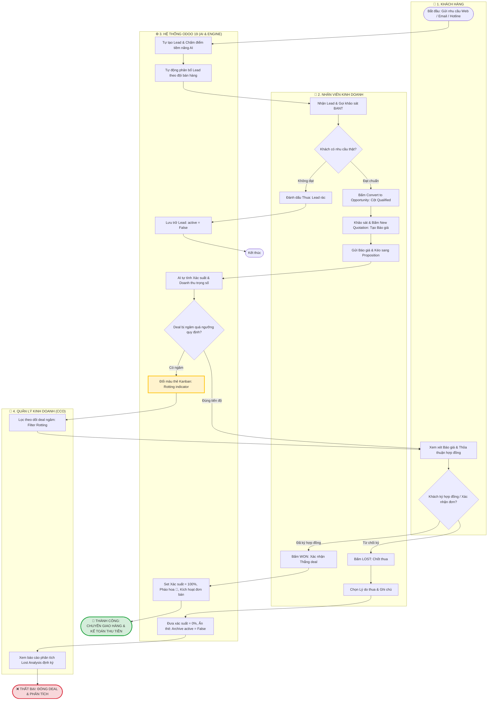

# QUY TRÌNH VÒNG ĐỜI ODOO CRM (SWIMLANE PROCESS FLOW)

> **Mục tiêu:** Bản vẽ quy trình Swimlane tổng quát, súc tích, **chữ lớn và tiếng Việt có dấu 100%**.  
> **Các bên tham gia (4 làn bơi):** Khách hàng | Nhân viên Kinh doanh | Hệ thống Odoo 19 | Quản lý Kinh doanh.  
> **File nguồn:** [crm-lifecycle-swimlane.puml](crm-lifecycle-swimlane.puml) | [crm-lifecycle-swimlane.drawio](crm-lifecycle-swimlane.drawio)  
> **File ảnh xuất ra:** [crm-lifecycle-swimlane.svg](crm-lifecycle-swimlane.svg) (Vector sắc nét) | [crm-lifecycle-swimlane.png](png/crm-lifecycle-swimlane.png) (Ảnh lớn)  
> 📌 **Tài liệu liên quan:** [README.md](../README.md)

---

## 1. BẢN VẼ SƠ ĐỒ HÌNH ẢNH (BẢN CHỮ LỚN - TIẾNG VIỆT CÓ DẤU)

---

## 2. SƠ ĐỒ MERMAID ĐỌC TRỰC TIẾP TRÊN MARKDOWN

---

## 3. TÓM TẮT 4 BƯỚC NGHIỆP VỤ CỐT LÕI

| Giai đoạn | Thao tác của Người dùng (User Action) | Hệ thống Odoo 19 tự động xử lý (System Logic) |
| :--- | :--- | :--- |
| **1. Tiếp nhận Lead** | Khách gửi thông tin liên hệ $\rightarrow$ Sale nhận thông báo. | Tự tạo Lead, kiểm tra trùng lặp và tự động phân bổ theo dung tích (Capacity). |
| **2. Thẩm định (Qualification)** | Sale gọi điện khảo sát nhu cầu theo chuẩn BANT. | Nếu tiềm năng $\rightarrow$ Bấm **Convert to Opportunity** (chuyển sang cột Qualified). |
| **3. Báo giá & Đàm phán** | Bấm **New Quotation** tạo Báo giá $\rightarrow$ Kéo sang cột **Proposition**. | AI tự tính xác suất chốt deal; Theo dõi mốc ngâm deal (**Rotting Threshold: 5, 14, 30 ngày tùy cấu hình**) để đổi màu cảnh báo. |
| **4. Chốt giao dịch** | **Thắng:** Bấm **Won** $\rightarrow$ Kích hoạt đơn hàng bán. **Thua:** Bấm **Lost** $\rightarrow$ Bắt buộc chọn Lý do thua. | Won: Xác suất nhảy 100%, ghi nhận doanh số. Lost: Xác suất về 0%, lưu trữ bản ghi và cập nhật báo cáo BI. |

> 💡 **Lưu ý nghiệp vụ BA về Rotting:**
> * Trong mã nguồn Odoo gốc: Giá trị mặc định là **`0`** (Tắt cảnh báo).
> * Trong dữ liệu mẫu Demo (Runbot): Cột *Proposition* được cài mẫu là **`5 ngày`** (đó là lý do thẻ 6 ngày bị đổi màu `6d`).
> * Trong thực tế triển khai: BA sẽ cùng Giám đốc Kinh doanh thỏa thuận SLA riêng cho từng giai đoạn (ví dụ: 7 ngày cho B2C, 14–21 ngày cho B2B phần mềm).

---

## 🗄️ LỊCH SỬ THAY ĐỔI TÀI LIỆU (CHANGELOG)

| Phiên bản | Ngày | Người cập nhật | Nội dung cập nhật |
| :---: | :---: | :---: | :--- |
| **v1.0** | 2026-09-04 | Lead BA & AI | Thiết kế sơ đồ Swimlane 4 luồng cho Vòng đời Odoo CRM. |
| **v2.0** | 2026-09-04 | Lead BA & AI | Tinh chỉnh chuẩn hóa luồng Won: Làm rõ điều kiện rẽ nhánh "Khách ký hợp đồng / Xác nhận đơn" và kích hoạt Đơn bán hàng chuyển Giao hàng & Kế toán thu tiền. |
