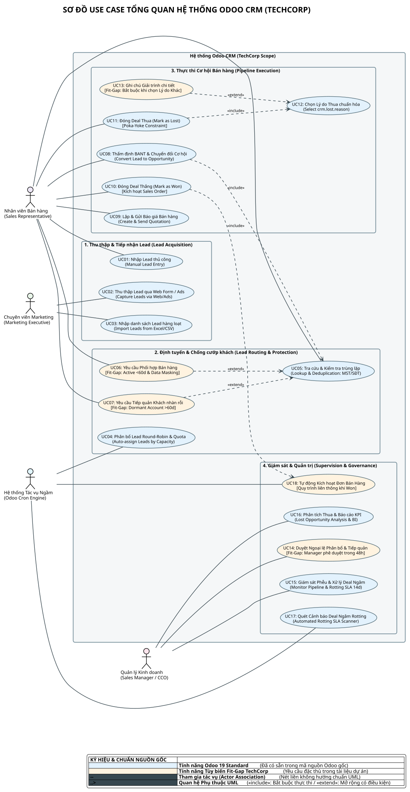
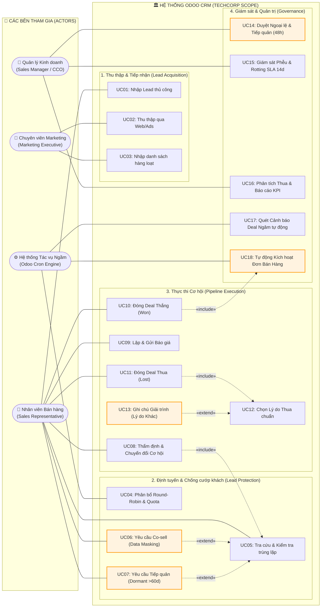

# SƠ ĐỒ USE CASE TỔNG QUAN HỆ THỐNG ODOO CRM (TECHCORP)

> **Dự án:** Tư vấn & Triển khai Odoo CRM (TechCorp)  
> **Phân hệ:** Odoo CRM (v19.0)  
> **Chủ đề:** System Boundary, Actor Roles, Functional Packages & UML Relationships  
> **Tác giả:** Lead Business Analyst (IT-BA)  
> **Chuẩn áp dụng:** Tiêu chuẩn thiết kế sơ đồ Use Case từ `diagram-skills-package` (PlantUML Native & Truy vết mã nguồn)  
> **File nguồn:** [crm-usecase.puml](crm-usecase.puml)  
> **File ảnh xuất ra:** [crm-usecase.svg](crm-usecase.svg) (Ảnh vector sắc nét) | [crm-usecase.png](png/crm-usecase.png) (Ảnh raster độ phân giải cao)  
> 📌 **Tài liệu liên quan:** [Lead_Assignment_Decision_Flow.md](Lead_Assignment_Decision_Flow.md) | [CRM_Lifecycle_Swimlane.md](CRM_Lifecycle_Swimlane.md) | [README.md](../README.md)

---

## 1. BẢN VẼ SƠ ĐỒ HÌNH ẢNH TRỰC QUAN (PLANTUML NATIVE RENDER)

---

## 2. BẢNG TRUY VẾT NGUỒN GỐC TÁC NHÂN (ACTORS TRACEABILITY)

Tất cả các tác nhân (Actors) đều được đặt **bên ngoài ranh giới hệ thống (System Boundary)** và liên kết với Use Case thông qua đường kết hợp không hướng (`--`), phản ánh sự tham gia vào tác vụ (participation) thay vì quyền điều khiển luồng:

| Actor | Tên Tiếng Việt & Vai Trò | Căn Cứ Mã Nguồn Odoo Standard | Căn Cứ Tài Liệu Nghiệp Vụ Dự Án | Đánh Giá Nguồn Gốc |
| :--- | :--- | :--- | :--- | :--- |
| **Sales Representative** (`SalesRep`) | **Nhân viên Bán hàng (Kinh doanh):** Thực hiện khảo sát BANT, tạo báo giá, chốt deal và phối hợp xử lý khách hàng. | [sales_team_security.xml](file:///e:/BA/Ba-case/odoo/odoo/odoo/addons/sales_team/security/sales_team_security.xml) (`group_sale_salesman` - "User: Own Documents Only") [crm_security.xml](file:///e:/BA/Ba-case/odoo/odoo/odoo/addons/crm/security/crm_security.xml) (`crm_rule_personal_lead`: `domain_force = ['\|',('user_id','=',user.id),('user_id','=',False)]`) | [case_module_4.md](file:///e:/BA/Ba-case/odoo/odoo/doc/case_module_4.md) (§ 3.1: Salesman B2B chỉ nhìn thấy cơ hội của chính mình) [CRM_Lifecycle_Swimlane.md](file:///e:/BA/Ba-case/odoo/odoo/diagram/CRM_Lifecycle_Swimlane.md) (Làn 2: Nhân viên Kinh doanh) | ✅ **100% Căn cứ thật** (Code Odoo & Doc dự án) |
| **Marketing Executive** (`Marketing`) | **Chuyên viên Marketing:** Vận hành thu thập lead qua các chiến dịch, landing page và nhập dữ liệu đối tác hàng loạt. | [crm_lead.py](file:///e:/BA/Ba-case/odoo/odoo/odoo/addons/crm/models/crm_lead.py) (UTM Mixin: `campaign_id`, `medium_id`, `source_id`) [crm_security.xml](file:///e:/BA/Ba-case/odoo/odoo/odoo/addons/crm/security/crm_security.xml) (`group_use_lead` - Hiển thị menu Quản trị Lead) | [Danh_Sach_So_Do_Can_Ve.md](file:///e:/BA/Ba-case/odoo/odoo/diagram/Danh_Sach_So_Do_Can_Ve.md) (§ 2.1: Marketing Executive thu thập Contact) [CRM_Architecture_ASCII.md](file:///e:/BA/Ba-case/odoo/odoo/doc/CRM_Architecture_ASCII.md) (§ 3: Phễu Marketing) | ✅ **100% Căn cứ thật** (Code Odoo & Doc dự án) |
| **Sales Manager / CCO** (`SalesMgr`) | **Quản lý Kinh doanh / CCO:** Phê duyệt ngoại lệ điều phối, giám sát SLA phễu bán hàng và phân tích báo cáo hiệu suất. | [sales_team_security.xml](file:///e:/BA/Ba-case/odoo/odoo/odoo/addons/sales_team/security/sales_team_security.xml) (`group_sale_manager` - "Administrator: All Documents") [crm_team.py](file:///e:/BA/Ba-case/odoo/odoo/odoo/addons/crm/models/crm_team.py) (Trường `user_id` / Team Leader) | [case.md](file:///e:/BA/Ba-case/odoo/odoo/doc/case.md) (§ 1: Giám đốc Kinh doanh CCO) [case_module_4.md](file:///e:/BA/Ba-case/odoo/odoo/doc/case_module_4.md) (§ 3.1: Toàn quyền xem và duyệt deal toàn quốc) | ✅ **100% Căn cứ thật** (Code Odoo & Doc dự án) |
| **Odoo Cron System** (`OdooCron`) | **Hệ thống Tác vụ Ngầm Odoo:** Thực hiện tự động hóa các tác vụ định kỳ như phân bổ xoay vòng, quét deal ngâm và kích hoạt đơn hàng. | [ir_cron_data.xml](file:///e:/BA/Ba-case/odoo/odoo/odoo/addons/crm/data/ir_cron_data.xml) (Cron `ir_cron_crm_lead_assign` gọi `model._cron_assign_leads()`) [crm_lead_prediction_data.xml](file:///e:/BA/Ba-case/odoo/odoo/odoo/addons/crm/data/crm_lead_prediction_data.xml) (Cron `website_crm_score_cron`) | [Danh_Sach_So_Do_Can_Ve.md](file:///e:/BA/Ba-case/odoo/odoo/diagram/Danh_Sach_So_Do_Can_Ve.md) (§ 2.1: Odoo Cron System) [CRM_Lifecycle_Swimlane.md](file:///e:/BA/Ba-case/odoo/odoo/diagram/CRM_Lifecycle_Swimlane.md) (Làn 3: Hệ thống Odoo 19) | ✅ **100% Căn cứ thật** (Code Odoo & Doc dự án) |

---

## 3. MA TRẬN ĐỐI CHIẾU NGUỒN GỐC 18 USE CASES (USE CASE TRACEABILITY MATRIX)

Toàn bộ Use Case được gom cụm vào **4 Package miền nghiệp vụ thật (Subdomains)**, phân định minh bạch giữa **Tính năng Chuẩn Odoo Standard** và **Tính năng Tùy biến Fit-Gap của dự án TechCorp**:

### 📦 Package 1: Thu thập & Tiếp nhận Lead (Lead Acquisition)

| Mã UC | Tên Nghiệp Vụ Use Case | Actor Chính | Căn Cứ File Mã Nguồn Odoo | Căn Cứ File Tài Liệu Dự Án | Phân Loại Chuẩn vs Fit-Gap |
| :---: | :--- | :---: | :--- | :--- | :--- |
| **UC01** | Nhập Lead thủ công (Manual Lead Entry) | `SalesRep` | [crm_lead.py](file:///e:/BA/Ba-case/odoo/odoo/odoo/addons/crm/models/crm_lead.py) (Model `crm.lead`, `type = 'lead'`) [crm_lead_views.xml](file:///e:/BA/Ba-case/odoo/odoo/odoo/addons/crm/views/crm_lead_views.xml) (Form view `crm_lead_view_form`) | [Danh_Sach_So_Do_Can_Ve.md](file:///e:/BA/Ba-case/odoo/odoo/diagram/Danh_Sach_So_Do_Can_Ve.md) (§ 2.1) | 🔵 **`[Odoo Standard]`** |
| **UC02** | Thu thập Lead qua Web Form / Ads | `Marketing` | [crm_lead.py](file:///e:/BA/Ba-case/odoo/odoo/odoo/addons/crm/models/crm_lead.py) (UTM Mixin: `medium_id`, `source_id`, `campaign_id`) | [case_module_4.md](file:///e:/BA/Ba-case/odoo/odoo/doc/case_module_4.md) (§ 2: Khối B2C Website & Digital) [Danh_Sach_So_Do_Can_Ve.md](file:///e:/BA/Ba-case/odoo/odoo/diagram/Danh_Sach_So_Do_Can_Ve.md) (§ 2.1) | 🔵 **`[Odoo Standard]`** |
| **UC03** | Nhập danh sách Lead hàng loạt (Import Excel/CSV) | `Marketing` | Odoo Base Import (`base_import`), Model `crm.lead` | [case_module_4.md](file:///e:/BA/Ba-case/odoo/odoo/doc/case_module_4.md) (§ 1: Xử lý danh sách khách hàng doanh nghiệp) | 🔵 **`[Odoo Standard]`** |

---

### 📦 Package 2: Định tuyến & Chống cướp khách (Lead Routing & Protection)

| Mã UC | Tên Nghiệp Vụ Use Case | Actor Chính | Căn Cứ File Mã Nguồn Odoo | Căn Cứ File Tài Liệu Dự Án | Phân Loại Chuẩn vs Fit-Gap |
| :---: | :--- | :---: | :--- | :--- | :--- |
| **UC04** | Phân bổ Lead tự động Round-Robin & Quota | `OdooCron` | [crm_team.py](file:///e:/BA/Ba-case/odoo/odoo/odoo/addons/crm/models/crm_team.py) (`_cron_assign_leads()`, `_action_assign_leads()`) [crm_team_member.py](file:///e:/BA/Ba-case/odoo/odoo/odoo/addons/crm/models/crm_team_member.py) (`assignment_max`, `assignment_domain`, `assignment_optout`, `lead_day_count`) | [case_module_4.md](file:///e:/BA/Ba-case/odoo/odoo/doc/case_module_4.md) (§ 2.1, 2.2: Round-Robin, Hạn mức 5 lead/ngày) [Lead_Assignment_Decision_Flow.md](file:///e:/BA/Ba-case/odoo/odoo/diagram/Lead_Assignment_Decision_Flow.md) (§ 2) | 🔵 **`[Odoo Standard]`** |
| **UC05** | Tra cứu & Kiểm tra trùng lặp (MST / SĐT) | `SalesRep` | [crm_lead_to_opportunity.py](file:///e:/BA/Ba-case/odoo/odoo/odoo/addons/crm/wizard/crm_lead_to_opportunity.py) (Trường `duplicated_lead_ids`, method `_compute_duplicated_lead_ids`) [crm_merge_opportunities.py](file:///e:/BA/Ba-case/odoo/odoo/odoo/addons/crm/wizard/crm_merge_opportunities.py) | [Lead_Assignment_Decision_Flow.md](file:///e:/BA/Ba-case/odoo/odoo/diagram/Lead_Assignment_Decision_Flow.md) (§ 2.1: Khóa nhận diện MST/SĐT) [Danh_Sach_So_Do_Can_Ve.md](file:///e:/BA/Ba-case/odoo/odoo/diagram/Danh_Sach_So_Do_Can_Ve.md) (§ 2.1) | 🔵 **`[Odoo Standard]`** |
| **UC06** | Yêu cầu Phối hợp Bán hàng (Co-sell) & Mặt nạ dữ liệu | `SalesRep` | ❌ *Không có sẵn trong Odoo Core gốc* (Odoo chỉ có ẩn/hiện cả bản ghi qua `ir.rule`, không có logic che chuỗi `0908.***.***` và nút Co-sell) | [Lead_Assignment_Decision_Flow.md](file:///e:/BA/Ba-case/odoo/odoo/diagram/Lead_Assignment_Decision_Flow.md) (§ 2.1: Khách hàng Active <60 ngày áp dụng Data Masking và nút "Yêu cầu phối hợp Co-sell") | 🟠 **`[Tùy biến Fit-Gap TechCorp]`** |
| **UC07** | Yêu cầu Tiếp quản Khách nhàn rỗi (Dormant Account) | `SalesRep` | ❌ *Không có sẵn trong Odoo Core gốc* (Odoo không tự động phân loại Dormant sau 60 ngày không tương tác kèm luồng xin tiếp quản) | [Lead_Assignment_Decision_Flow.md](file:///e:/BA/Ba-case/odoo/odoo/diagram/Lead_Assignment_Decision_Flow.md) (§ 2.2: Khách bỏ rơi >60 ngày cho phép sales mới bấm "Yêu cầu thu hồi & Tiếp quản") | 🟠 **`[Tùy biến Fit-Gap TechCorp]`** |

---

### 📦 Package 3: Thực thi Cơ hội Bán hàng (Pipeline Execution)

| Mã UC | Tên Nghiệp Vụ Use Case | Actor Chính | Căn Cứ File Mã Nguồn Odoo | Căn Cứ File Tài Liệu Dự Án | Phân Loại Chuẩn vs Fit-Gap |
| :---: | :--- | :---: | :--- | :--- | :--- |
| **UC08** | Thẩm định BANT & Chuyển đổi Cơ hội (Convert) | `SalesRep` | [crm_lead_to_opportunity.py](file:///e:/BA/Ba-case/odoo/odoo/odoo/addons/crm/wizard/crm_lead_to_opportunity.py) (Model `crm.lead2opportunity.partner`) [crm_lead.py](file:///e:/BA/Ba-case/odoo/odoo/odoo/addons/crm/models/crm_lead.py) (`convert_opportunity()`) | [CRM_Lifecycle_Swimlane.md](file:///e:/BA/Ba-case/odoo/odoo/diagram/CRM_Lifecycle_Swimlane.md) (Làn 2, bước `SP2: Bấm Convert to Opportunity: Cột Qualified`) | 🔵 **`[Odoo Standard]`** |
| **UC09** | Lập & Gửi Báo giá Bán hàng (Create Quotation) | `SalesRep` | Module liên kết `sale_crm` trong Odoo tiêu chuẩn (Action `sale_crm.action_sale_quotations_new` trên form `crm.lead`) | [CRM_Lifecycle_Swimlane.md](file:///e:/BA/Ba-case/odoo/odoo/diagram/CRM_Lifecycle_Swimlane.md) (Làn 2, bước `SP3: Bấm New Quotation`) | 🔵 **`[Odoo Standard mở rộng sale_crm]`** |
| **UC10** | Đóng Deal Thắng (Mark as Won) | `SalesRep` | [crm_lead.py](file:///e:/BA/Ba-case/odoo/odoo/odoo/addons/crm/models/crm_lead.py) (`action_set_won()`, `action_set_won_rainbowman()`) [crm_stage.py](file:///e:/BA/Ba-case/odoo/odoo/odoo/addons/crm/models/crm_stage.py) (`is_won = True`, set `probability = 100`) | [CRM_Lifecycle_Swimlane.md](file:///e:/BA/Ba-case/odoo/odoo/diagram/CRM_Lifecycle_Swimlane.md) (Làn 2, bước `SP_Won: Bấm WON`) | 🔵 **`[Odoo Standard]`** |
| **UC11** | Đóng Deal Thua (Mark as Lost) | `SalesRep` | [crm_lead.py](file:///e:/BA/Ba-case/odoo/odoo/odoo/addons/crm/models/crm_lead.py) (`action_set_lost()`) [crm_lead_lost.py](file:///e:/BA/Ba-case/odoo/odoo/odoo/addons/crm/wizard/crm_lead_lost.py) (Model `crm.lead.lost`) | [CRM_Lifecycle_Swimlane.md](file:///e:/BA/Ba-case/odoo/odoo/diagram/CRM_Lifecycle_Swimlane.md) (Làn 2, bước `SP_Lost: Bấm LOST`) [case.md](file:///e:/BA/Ba-case/odoo/odoo/doc/case.md) (§ 2.2) | 🔵 **`[Odoo Standard]`** |
| **UC12** | Chọn Lý do Thua chuẩn hóa (`crm.lost.reason`) | `SalesRep` | [crm_lost_reason.py](file:///e:/BA/Ba-case/odoo/odoo/odoo/addons/crm/models/crm_lost_reason.py) (Model `crm.lost.reason`) [crm_lead_lost.py](file:///e:/BA/Ba-case/odoo/odoo/odoo/addons/crm/wizard/crm_lead_lost.py) (Trường `lost_reason_id`) | [case.md](file:///e:/BA/Ba-case/odoo/odoo/doc/case.md) (§ 2.2.a: 5-7 lý do chuẩn; § 2.2.b: Khóa nút xác nhận `required = True`) | 🔵 **`[Odoo Standard]`** |
| **UC13** | Ghi chú Giải trình chi tiết khi chọn "Lý do khác" | `SalesRep` | Trường `lost_feedback` đã có trong [crm_lead_lost.py](file:///e:/BA/Ba-case/odoo/odoo/odoo/addons/crm/wizard/crm_lead_lost.py) nhưng trong Odoo Standard **không bắt buộc** | [case.md](file:///e:/BA/Ba-case/odoo/odoo/doc/case.md) (§ 2.2.b: Ràng buộc Poka-Yoke bắt buộc nhập khi chọn "Lý do khác") | 🟠 **`[Tùy biến Ràng buộc Fit-Gap]`** |

---

### 📦 Package 4: Giám sát & Quản trị (Supervision & Governance)

| Mã UC | Tên Nghiệp Vụ Use Case | Actor Chính | Căn Cứ File Mã Nguồn Odoo | Căn Cứ File Tài Liệu Dự Án | Phân Loại Chuẩn vs Fit-Gap |
| :---: | :--- | :---: | :--- | :--- | :--- |
| **UC14** | Duyệt Ngoại lệ Phân bổ & Tiếp quản Deal | `SalesMgr` | ❌ *Không có workflow duyệt trong Odoo Standard core* (Chỉ có quyền Manager sửa thủ công `user_id` qua nhóm `group_sale_manager`) | [Lead_Assignment_Decision_Flow.md](file:///e:/BA/Ba-case/odoo/odoo/diagram/Lead_Assignment_Decision_Flow.md) (§ 2.2: Trưởng phòng duyệt tiếp quản trong vòng 48 giờ) | 🟠 **`[Tùy biến Fit-Gap TechCorp]`** |
| **UC15** | Giám sát Phễu Bán hàng & Xử lý Deal Ngâm | `SalesMgr` | [crm_stage.py](file:///e:/BA/Ba-case/odoo/odoo/odoo/addons/crm/models/crm_stage.py) (`rotting_threshold_days = fields.Integer('Days to rot', default=0)`) Bộ lọc Filter Rotting trên Kanban view | [case.md](file:///e:/BA/Ba-case/odoo/odoo/doc/case.md) (§ 2.1: Rotting SLA 14 ngày, CCO lọc can thiệp) [case_module_5.md](file:///e:/BA/Ba-case/odoo/odoo/doc/case_module_5.md) (§ 2.2: Slipping Deals tracking) | 🔵 **`[Odoo Standard]`** |
| **UC16** | Phân tích Thua (Lost Analysis) & Báo cáo KPI | `SalesMgr` | [crm_lost_reason.py](file:///e:/BA/Ba-case/odoo/odoo/odoo/addons/crm/models/crm_lost_reason.py) (`action_lost_leads()`) [report/](file:///e:/BA/Ba-case/odoo/odoo/odoo/addons/crm/report/) (Model `crm.activity.report`) | [case.md](file:///e:/BA/Ba-case/odoo/odoo/doc/case.md) (§ 2.2.c: Lost Opportunity Analysis theo ma trận Lý do x Doanh thu x Đối thủ) [case_module_5.md](file:///e:/BA/Ba-case/odoo/odoo/doc/case_module_5.md) (§ 2.3: Báo cáo Pivot Table đa chiều) | 🔵 **`[Odoo Standard]`** |
| **UC17** | Quét Cảnh báo Deal Ngâm Rotting tự động | `OdooCron` | Trong Odoo Standard, `rotting_threshold_days` được engine Web client tính toán visual. Việc bắn cảnh báo Chatter tự động cần cấu hình *Automated Action* | [case.md](file:///e:/BA/Ba-case/odoo/odoo/doc/case.md) (§ 2.1.b: Mốc 14 ngày tự tạo `mail.activity`; Mốc 16 ngày escalation gửi kênh quản lý) [CRM_Lifecycle_Swimlane.md](file:///e:/BA/Ba-case/odoo/odoo/diagram/CRM_Lifecycle_Swimlane.md) (Làn 3, bước `S_RottingCheck`) | 🟠 **`[Odoo Kanban Standard + Automated Action mở rộng]`** |
| **UC18** | Tự động Kích hoạt Đơn Bán Hàng khi Won | `OdooCron` | ❌ Odoo Standard gốc chỉ chuyển stage và set xác suất 100%, không tự động sinh `sale.order` nếu không cấu hình liên thông | [CRM_Lifecycle_Swimlane.md](file:///e:/BA/Ba-case/odoo/odoo/diagram/CRM_Lifecycle_Swimlane.md) (Làn 3, bước `S_WonAction: Kích hoạt đơn bán`) [CRM_Architecture_ASCII.md](file:///e:/BA/Ba-case/odoo/odoo/doc/CRM_Architecture_ASCII.md) (§ 1, tầng 5) | 🟠 **`[Quy trình liên kết mở rộng TechCorp]`** |

---

## 4. BẢNG PHÂN TÍCH QUAN HỆ UML (`<<include>>` & `<<extend>>`)

Theo quy tắc của `diagram-skills-package`, các quan hệ UML bắt buộc phải có **bằng chứng nghiệp vụ xác thực (Evidence & Rationale)**, hướng mũi tên tuân thủ nghiêm ngặt chuẩn UML 2.5:

| Quan Hệ | Từ (From) | Đến (To) | Hướng Mũi Tên & Căn Cứ Nghiệp Vụ (Rationale) | Nguồn Trích Dẫn |
| :---: | :---: | :---: | :--- | :--- |
| **`<<include>>`** | `UC08` (Chuyển đổi Cơ hội) | `UC05` (Kiểm tra Trùng lặp) | **Base $\rightarrow$ Included:** Thao tác chuyển đổi Lead sang Opportunity bắt buộc phải thực thi hàm kiểm tra khách hàng trùng lặp trong hệ thống (`_compute_duplicated_lead_ids`) nhằm cho phép Sales chọn tạo khách mới hay gộp vào khách hàng có sẵn. | [crm_lead_to_opportunity.py](file:///e:/BA/Ba-case/odoo/odoo/odoo/addons/crm/wizard/crm_lead_to_opportunity.py#L40-L42) |
| **`<<include>>`** | `UC11` (Đóng Deal Thua) | `UC12` (Chọn Lý do Thua) | **Base $\rightarrow$ Included:** Thao tác bấm nút Lost bắt buộc mở popup wizard `crm.lead.lost`. Quy tắc Poka-Yoke ràng buộc trường `lost_reason_id` thành bắt buộc nhập (`required = True`), không thể đóng deal nếu chưa chọn lý do chuẩn hóa. | [case.md](file:///e:/BA/Ba-case/odoo/odoo/doc/case.md#L62-L64) [crm_lead_lost.py](file:///e:/BA/Ba-case/odoo/odoo/odoo/addons/crm/wizard/crm_lead_lost.py) |
| **`<<include>>`** | `UC10` (Đóng Deal Thắng) | `UC18` (Kích hoạt Đơn Bán) | **Base $\rightarrow$ Included:** Khi bấm nút Won xác nhận chốt hợp đồng thành công, hệ thống bắt buộc kích hoạt luồng tự động chuyển tiếp dữ liệu sang phân hệ Bán hàng để khởi tạo Đơn hàng bán (Sales Order). | [CRM_Lifecycle_Swimlane.md](file:///e:/BA/Ba-case/odoo/odoo/diagram/CRM_Lifecycle_Swimlane.md) (Bước `SP_Won` $\rightarrow$ `S_WonAction`) |
| **`<<extend>>`** | `UC06` (Yêu cầu Co-sell) | `UC05` (Kiểm tra Trùng lặp) | **Extending $\rightarrow$ Base:** Hành vi yêu cầu phối hợp bán hàng chỉ xảy ra **có điều kiện** khi việc tra cứu phát hiện khách hàng trùng đang thuộc sở hữu của một Sales khác và đang Active (< 60 ngày), lúc này hệ thống che thông tin (Data Masking) và mở nút Co-sell. | [Lead_Assignment_Decision_Flow.md](file:///e:/BA/Ba-case/odoo/odoo/diagram/Lead_Assignment_Decision_Flow.md#L26-L28) |
| **`<<extend>>`** | `UC07` (Yêu cầu Tiếp quản) | `UC05` (Kiểm tra Trùng lặp) | **Extending $\rightarrow$ Base:** Hành vi xin tiếp quản khách chỉ xảy ra **có điều kiện** khi việc tra cứu phát hiện khách hàng trùng đã bị bỏ rơi không tương tác quá 60 ngày (Dormant Account). | [Lead_Assignment_Decision_Flow.md](file:///e:/BA/Ba-case/odoo/odoo/diagram/Lead_Assignment_Decision_Flow.md#L29-L32) |
| **`<<extend>>`** | `UC13` (Giải trình chi tiết) | `UC12` (Chọn Lý do Thua) | **Extending $\rightarrow$ Base:** Ô nhập ghi chú giải trình chi tiết `lost_feedback` chỉ chuyển sang trạng thái bắt buộc nhập **khi và chỉ khi** nhân viên chọn phương án *"Lý do khác"*. | [case.md](file:///e:/BA/Ba-case/odoo/odoo/doc/case.md#L64-L65) |

---

## 5. SƠ ĐỒ MERMAID THAY THẾ (CHO TRÌNH XEM TRỰC TIẾP TRÊN GITHUB / OBSIDIAN)

Nếu xem trực tiếp trên GitHub hoặc Markdown Preview không hỗ trợ file `.puml`, sơ đồ Mermaid dưới đây mô phỏng trực quan tương đương:

---

## 6. Ý NGHĨA DƯỚI LĂNG KÍNH IT BUSINESS ANALYST (IT-BA INSIGHTS)

1. **Minh bạch hóa Phạm vi Dự án (Project Scope Clarity):**
   - Sơ đồ Use Case phân định ranh giới rõ ràng: Cái gì Odoo CRM làm, cái gì do người dùng bên ngoài kích hoạt. Tránh bẫy "scope creep" (phình phạm vi) thường gặp trong triển khai ERP/CRM.
2. **Đối chiếu Chuẩn Odoo (Standard) vs Tùy biến (Customization):**
   - Một IT-BA chuyên nghiệp không bao giờ tư vấn doanh nghiệp đập đi xây lại hệ thống. Bằng cách phân biệt rõ `[Odoo Standard]` (tận dụng 100% logic có sẵn của Odoo 19 như Round-Robin, Quotas, Rotting SLA) và `[Tùy biến Fit-Gap]` (Data Masking, Co-sell, Dormant Account), BA chứng minh cho Ban Giám đốc thấy giải pháp vừa giải quyết triệt để nỗi đau doanh nghiệp vừa tiết kiệm tối đa ngân sách triển khai.
3. **Tuân thủ Chuẩn mực Mô hình hóa (UML Modeling Rigor):**
   - Việc kiên quyết áp dụng đường nối không hướng `--` cho Actor và chỉ dùng `<<include>>`/`<<extend>>` khi có bằng chứng nghiệp vụ xác thực giúp bộ tài liệu Portfolio ghi điểm tuyệt đối trong mắt các nhà tuyển dụng và chuyên gia đánh giá kỹ thuật.

---

## 🗄️ LỊCH SỬ THAY ĐỔI TÀI LIỆU (CHANGELOG)

| Phiên bản | Ngày | Người cập nhật | Nội dung cập nhật |
| :---: | :---: | :---: | :--- |
| **v1.0** | 2026-09-06 | Lead IT-BA | Khởi tạo sơ đồ Use Case tổng quan Odoo CRM (TechCorp), mã nguồn PlantUML, render SVG/PNG và lập bảng ma trận đối chiếu nguồn gốc mã nguồn chuẩn Odoo Standard vs Fit-Gap. |
