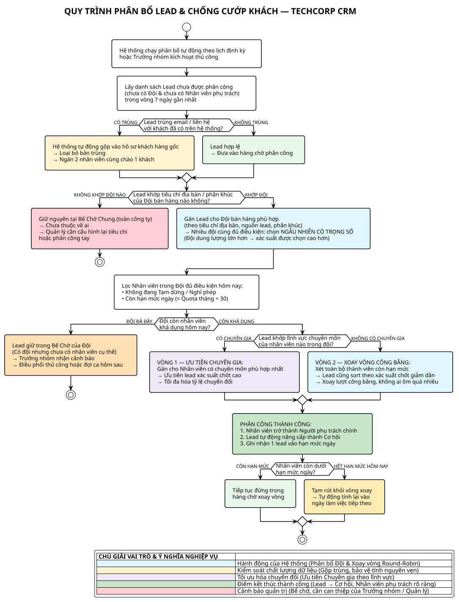

# SƠ ĐỒ QUYẾT ĐỊNH: THUẬT TOÁN PHÂN BỔ & KHỬ TRÙNG LẶP LEAD (100% ODOO STANDARD)

> **Dự án:** Tư vấn & Triển khai Odoo CRM (TechCorp)  
> **Phân hệ:** Odoo CRM (v19.0)  
> **Chủ đề:** Lead Deduplication, Team Allocation, Capacity Quotas & Two-pass Round-Robin Engine  
> **Tác giả:** Lead Business Analyst (IT-BA)  
> **Chuẩn áp dụng:** 100% Căn cứ mã nguồn Odoo tiêu chuẩn (`addons/crm/`) & Tiêu chuẩn mô hình hóa từ `diagram-skills-package`  
> **File nguồn:** [lead-assignment-antipoaching.puml](lead-assignment-antipoaching.puml) | [lead-assignment-antipoaching.drawio](lead-assignment-antipoaching.drawio)  
> **File ảnh xuất ra:** [lead-assignment-antipoaching.svg](lead-assignment-antipoaching.svg) (Ảnh Vector) | [lead-assignment-antipoaching.png](png/lead-assignment-antipoaching.png) (Ảnh Raster nét cao)  
> 📌 **Tài liệu liên quan:** [lead-assignment-mermaid.md](lead-assignment-mermaid.md) | [CRM_UseCase_Overview.md](CRM_UseCase_Overview.md) | [README.md](../README.md)

---

## 1. BẢN VẼ SƠ ĐỒ HÌNH ẢNH TRỰC QUAN (PLANTUML NATIVE RENDER)

---

## 2. MA TRẬN ĐỐI CHIẾU MÃ NGUỒN ODOO STANDARD (TRACEABILITY MATRIX)

Toàn bộ các điều kiện rẽ nhánh và hành động trong sơ đồ quyết định đều được ánh xạ trực tiếp 1:1 với mã nguồn Odoo 19 tiêu chuẩn:

| Bước / Điểm Nút | Thao Tác / Điều Kiện Nghiệp Vụ | Model & File Mã Nguồn | Dòng Code & Hàm Phụ Trách Cụ Thể |
| :---: | :--- | :--- | :--- |
| **01. Khởi chạy Tác vụ** | Tác vụ Cron chạy định kỳ hoặc Quản lý kích hoạt thủ công trên giao diện Đội bán hàng. | `ir.cron` [crm_team.py](file:///e:/BA/Ba-case/odoo/odoo/odoo/addons/crm/models/crm_team.py) | [ir_cron_data.xml](file:///e:/BA/Ba-case/odoo/odoo/odoo/addons/crm/data/ir_cron_data.xml) gọi `model._cron_assign_leads()` (Line 164) hoặc button gọi `action_assign_leads()` (Line 187). |
| **02. Lọc Lead Hợp lệ** | Quét các lead chưa gán (`team_id = False`, `user_id = False`, `won_status != 'won'`) tạo trong 7 ngày gần nhất. | `crm.lead` [crm_team.py](file:///e:/BA/Ba-case/odoo/odoo/odoo/addons/crm/models/crm_team.py) | Hàm `_allocate_leads(creation_delta_days=7)` (Lines 417–426): Thiết lập `lead_domain` lọc lead sống để chuẩn bị chia. |
| **03. Kiểm tra Trùng lặp** | Kiểm tra xem email hoặc thông tin liên hệ của lead đã tồn tại cơ hội nào trước đó hay chưa. | `crm.lead` [crm_lead.py](file:///e:/BA/Ba-case/odoo/odoo/odoo/addons/crm/models/crm_lead.py) | `duplicates_lead_cache[lead] = lead._get_lead_duplicates(email=lead.email_from)` (Lines 429–432, 520–522). Đếm `len(lead_duplicates) > 1`. |
| **04A. Tự động Gộp Lead** | Nếu phát hiện trùng lặp, Odoo tự động gộp các lead trùng vào 1 bản ghi chính, dọn dẹp các bản ghi rác. | `crm.lead` [crm_team.py](file:///e:/BA/Ba-case/odoo/odoo/odoo/addons/crm/models/crm_team.py) | `merged = lead_duplicates._merge_opportunity(user_id=False, team_id=False)` (Line 537). Tránh việc phân bổ 2 lead cùng khách cho 2 nhân viên khác nhau. |
| **04B. Giữ Lead Độc lập** | Nếu không trùng lặp, lead được đưa thẳng vào danh sách chờ phân bổ cho Đội bán hàng. | `crm.lead` [crm_team.py](file:///e:/BA/Ba-case/odoo/odoo/odoo/addons/crm/models/crm_team.py) | `leads_assigned += lead` (Line 527). |
| **05. Lọc Domain của Đội** | Kiểm tra lead có thỏa mãn điều kiện nguồn, quốc gia, địa bàn của Đội (`team.assignment_domain`). | `crm.team` [crm_team.py](file:///e:/BA/Ba-case/odoo/odoo/odoo/addons/crm/models/crm_team.py) | `literal_eval(team.assignment_domain or '[]')` (Lines 417–422). |
| **06. Bể Chưa Gán Chung** | Lead không khớp bất kỳ đội nào sẽ giữ nguyên `team_id = False`, `user_id = False` tại Bể chung toàn công ty. | `crm.team` [crm_team.py](file:///e:/BA/Ba-case/odoo/odoo/odoo/addons/crm/models/crm_team.py) | Thông báo: *"No allocated leads to any team or salesperson. Check your Sales Teams configuration"* (Lines 290–292). |
| **07. Gán Cho Đội Bán Hàng** | Gán `team_id` cho lead bằng **thuật toán ngẫu nhiên có trọng số** (Weighted Random): đội có `assignment_max` lớn hơn có xác suất được chọn cao hơn, nhưng không chắc chắn (non-deterministic). | `crm.team` [crm_team.py](file:///e:/BA/Ba-case/odoo/odoo/odoo/addons/crm/models/crm_team.py) | Lines 440–442 + Line 454: `weights.append(team.assignment_max)` → `random.choices(population, weights=weights, k=1)[0]`. Không phải "ưu tiên đội lớn nhất" mà là xác suất tỷ lệ thuận với dung lượng. |
| **08. Lọc Thành viên Đội** | Lọc các nhân viên: (1) Không bật cờ Tạm dừng (`not assignment_optout`); (2) Còn chỉ tiêu ngày (`quota > 0`). | `crm.team.member` [crm_team_member.py](file:///e:/BA/Ba-case/odoo/odoo/odoo/addons/crm/models/crm_team_member.py) | Lines 619–621: `team.crm_team_member_ids.filtered(lambda m: not m.assignment_optout and quota_per_member.get(m, 0) > 0)`. |
| **09. Xử lý Cả Đội Hết Quota** | Nếu toàn bộ thành viên trong đội đều đạt trần hoặc tạm dừng, lead giữ `team_id` nhưng `user_id = False`. | `crm.team` [crm_team.py](file:///e:/BA/Ba-case/odoo/odoo/odoo/addons/crm/models/crm_team.py) | Line 622: `if not members_to_assign: continue`. Lead nằm tại Bể chờ của Đội để xử lý ở ca làm việc tiếp theo. |
| **10. Vòng 1: Gán Ưu Tiên** | Quét các thành viên có `assignment_domain_preferred` khớp lead; sắp xếp theo xác suất chốt giảm dần (`-lead.probability`). | `crm.team.member` [crm_team.py](file:///e:/BA/Ba-case/odoo/odoo/odoo/addons/crm/models/crm_team.py) | Lines 632–648: Vòng lặp ưu tiên gán deal giá trị cao / tiềm năng cho chuyên gia trước. |
| **11. Vòng 2: Xoay Vòng Round-Robin** | Gán các lead còn lại cho **toàn bộ thành viên** có `assignment_domain` tương thích (không giới hạn chuyên gia). Lead **cũng được sắp xếp theo xác suất chốt giảm dần** (`-lead.probability`) giống Vòng 1 — điểm khác biệt là pool thành viên rộng hơn. | `crm.team` [crm_team.py](file:///e:/BA/Ba-case/odoo/odoo/odoo/addons/crm/models/crm_team.py) | Lines 657–669: `for lead in to_assign.sorted(lambda lead: (-lead.probability, id))`. Xoay vòng công bằng qua `assign_lst`. |
| **12. Gán Thành Công & Cập Nhật Hàng Đợi** | 1. Cập nhật `user_id = member.user_id` 2. Tự động chuyển đổi thành Cơ hội (`convert_opportunity`) 3. Trừ 1 quota ngày (`quota -= 1`) 4. Nếu còn quota $\rightarrow$ Đẩy xuống cuối hàng đợi; Nếu hết $\rightarrow$ Rút khỏi vòng quay hôm nay. | `crm.lead` [crm_team.py](file:///e:/BA/Ba-case/odoo/odoo/odoo/addons/crm/models/crm_team.py) | Lines 601–616: Gọi `lead.convert_opportunity()`, cập nhật mảng `assign_lst` và bộ đếm hạn mức `members_quota`. |

---

## 3. BẢNG QUYẾT ĐỊNH ĐIỀU KIỆN LOGIC (BUSINESS DECISION TABLE)

Dành cho IT-BA và Kỹ sư Triển khai ERP để kiểm thử mọi trường hợp biên (Edge cases):

| Quy Tắc (Rule) | Trùng lặp Lead (`_get_lead_duplicates`) | Khớp Domain Đội (`team.assignment_domain`) | Trạng Thái Thành Viên (`assignment_optout`) | Hạn Mức Ngày Còn Lại (`quota > 0`) | Khớp Ưu Tiên (`domain_preferred`) | Kết Quả Thực Thi (Action & Outcome) |
| :---: | :---: | :---: | :---: | :---: | :---: | :--- |
| **R1** | Có (`len > 1`) | Khớp | Đang làm việc (`False`) | Còn Quota ($>0$) | Khớp | Tự động gộp bản ghi $\rightarrow$ Gán cho chuyên gia ưu tiên $\rightarrow$ Chuyển thành Cơ hội $\rightarrow$ Trừ 1 quota. |
| **R2** | Không (`len = 1`) | Khớp | Đang làm việc (`False`) | Còn Quota ($>0$) | Không | Giữ nguyên lead $\rightarrow$ Gán xoay vòng Round-Robin $\rightarrow$ Chuyển thành Cơ hội $\rightarrow$ Đẩy xuống cuối hàng đợi. |
| **R3** | Bất kỳ | Khớp | Đang làm việc (`False`) | Hết Quota ($=0$) | Bất kỳ | Bỏ qua nhân sự này $\rightarrow$ Chuyển lượt sang thành viên tiếp theo trong hàng đợi còn quota. |
| **R4** | Bất kỳ | Khớp | Nghỉ phép (`True`) | Bất kỳ | Bất kỳ | Bỏ qua nhân sự này (Pause Assignment) để đảm bảo cam kết SLA phản hồi lead. |
| **R5** | Bất kỳ | Khớp | Cả đội hết quota / nghỉ | $= 0$ | Bất kỳ | Lead được gán cho Đội (`team_id = ID`), nhưng `user_id = False` (Bể chờ của Đội). |
| **R6** | Bất kỳ | Không khớp đội nào | — | — | — | Lead giữ `team_id = False` và `user_id = False` (Bể chưa gán chung toàn công ty). |

---

## 4. Ý NGHĨA QUẢN TRỊ DƯỚI GÓC NHÌN IT-BA (BUSINESS VALUE)

1. **Bảo vệ toàn vẹn dữ liệu tự động (Automated Data Hygiene):**  
   - Bằng cách nhúng bước khử trùng lặp (`_get_lead_duplicates` & `_merge_opportunity`) ngay trước khi chia khách, Odoo giải quyết triệt để vấn đề "dữ liệu bẩn" và xung đột nội bộ mà không cần sự can thiệp thủ công của con người.
2. **Cân bằng tải khoa học (Workload Balancing):**  
   - Quota mỗi ngày được tính tự động: `quota = assignment_max / 30` (làm tròn) — tức là hạn mức 30 ngày chia đều cho từng ngày. Cơ chế này ngăn chặn nhân viên "ôm đồm" quá nhiều lead, bảo toàn SLA tiếp cận khách hàng tiềm năng. Lưu ý: con số cụ thể (VD: 5 lead/ngày) phụ thuộc vào `assignment_max` được cấu hình cho từng thành viên, không phải hằng số Odoo gốc.
3. **Phân hóa chuyên môn thông minh (Two-pass Heuristic):**  
   - Việc tách thành 2 vòng quét: Vòng 1 ưu tiên deal ngon/VIP cho chuyên gia (`assignment_domain_preferred`) và Vòng 2 chia đều cho tập thể giúp tối đa hóa tỷ lệ chuyển đổi (Conversion Rate) của toàn bộ doanh nghiệp.

---

## 🗄️ LỊCH SỬ THAY ĐỔI TÀI LIỆU (CHANGELOG)

| Phiên bản | Ngày | Người cập nhật | Nội dung cập nhật |
| :---: | :---: | :---: | :--- |
| **v1.0** | 2026-09-04 | Lead IT-BA | Khởi tạo sơ đồ quyết định phân bổ lead và chống cướp khách kết hợp Fit-Gap. |
| **v2.0** | 2026-09-06 | Lead IT-BA | Chuẩn hóa 100% theo mã nguồn Odoo 19 Standard (`crm_team.py`, `crm_team_member.py`), loại bỏ các phần tử Fit-Gap để đảm bảo tính nguyên bản của giải pháp phần mềm lõi. |
| **v3.0** | 2026-09-06 | Lead IT-BA | Sửa 3 sai lệch sau khi traceability check: (1) Cơ chế chọn Đội là Weighted Random, không phải deterministic; (2) Vòng 2 cũng sort theo `-lead.probability`; (3) Quota ngày = `assignment_max ÷ 30`, không hardcode số cụ thể. |
