# SƠ ĐỒ QUYẾT ĐỊNH: THUẬT TOÁN PHÂN BỔ & KHỬ TRÙNG LẶP LEAD (100% ODOO STANDARD)

> **Phân hệ:** Odoo CRM (v19.0)  
> **Kiểu sơ đồ:** Mermaid Flowchart (Đọc trực tiếp trên GitHub / Obsidian Markdown)  
> **Tiêu chuẩn:** 100% Căn cứ mã nguồn Odoo tiêu chuẩn (`crm_team.py`, `crm_team_member.py`, `crm_lead.py`)  
> **File ảnh đồ họa tương ứng:** [lead-assignment-antipoaching.svg](file:///e:/BA/Ba-case/odoo/odoo/diagram/lead-assignment-antipoaching.svg) | [lead-assignment-antipoaching.png](file:///e:/BA/Ba-case/odoo/odoo/diagram/png/lead-assignment-antipoaching.png)  
> 📌 **Tài liệu thuyết minh chi tiết:** [Lead_Assignment_Decision_Flow.md](file:///e:/BA/Ba-case/odoo/odoo/diagram/Lead_Assignment_Decision_Flow.md)

---

## 1. SƠ ĐỒ MERMAID QUYẾT ĐỊNH NGUYÊN BẢN ODOO STANDARD

```mermaid
flowchart TD
    Start([Bắt đầu: Cron định kỳ hoặc Quản lý bấm Assign Leads]) --> ScanLeads[Tìm kiếm Lead chưa phân bổ trong 7 ngày gần nhất<br/><i>CrmTeam._allocate_leads</i>]
    
    %% GIAI ĐOẠN 1: KHỬ TRÙNG LẶP
    ScanLeads --> CheckDup{Phát hiện trùng lặp Email/Contact?<br/><i>len _get_lead_duplicates > 1</i>}
    CheckDup -- Có trùng lặp --> AutoMerge[Tự động Gộp vào bản ghi chính<br/><i>Lead._merge_opportunity</i>]
    CheckDup -- Không trùng --> DirectLead[Giữ Lead độc lập]
    
    AutoMerge --> CheckTeamDomain
    DirectLead --> CheckTeamDomain
    
    %% GIAI ĐOẠN 2: PHÂN BỔ ĐỘI BÁN HÀNG
    CheckTeamDomain{Lead khớp Domain của Đội Bán hàng?<br/><i>team.assignment_domain</i>}
    CheckTeamDomain -- Không khớp đội nào --> UnassignedPool[Treo tại Bể Chưa Gán Chung<br/><i>team_id = False, user_id = False</i>]
    CheckTeamDomain -- Khớp Domain Đội --> AssignTeam[Chọn Đội bằng Weighted Random<br/><i>Xác suất ≈ tỷ lệ assignment_max của từng đội</i>]
    
    %% GIAI ĐOẠN 3: PHÂN BỔ NHÂN VIÊN TRONG ĐỘI
    AssignTeam --> FilterMembers[Lọc thành viên khả dụng trong Đội:<br/>1. not member.assignment_optout<br/>2. quota_per_member > 0]
    
    FilterMembers --> CheckAvailable{Đội còn thành viên<br/>khả dụng hôm nay?}
    CheckAvailable -- Hết Quota cả đội --> TeamQueue[Lead thuộc Đội nhưng user_id TRỐNG<br/><i>Bể chờ của Đội bán hàng</i>]
    
    CheckAvailable -- Còn thành viên --> CheckPref{Khớp tiêu chí Ưu tiên?<br/><i>assignment_domain_preferred</i>}
    
    CheckPref -- Khớp Ưu tiên --> Pass1[Vòng 1: Gán Ưu tiên Chuyên gia<br/><i>Chỉ xem xét member có assignment_domain_preferred</i><br/><i>Sort lead theo -lead.probability</i>]
    CheckPref -- Không khớp --> Pass2[Vòng 2: Gán Xoay vòng Round-Robin<br/><i>Xem xét toàn bộ thành viên còn hạn mức</i><br/><i>Cũng sort lead theo -lead.probability</i>]
    
    Pass1 --> AssignSuccess[GÁN LEAD THÀNH CÔNG:<br/>1. Gán user_id = member.user_id<br/>2. Chuyển đổi thành Cơ hội convert_opportunity<br/>3. Trừ 1 chỉ tiêu ngày members_quota -= 1]
    Pass2 --> AssignSuccess
    
    AssignSuccess --> CheckRemaining{Thành viên còn<br/>Quota hôm nay?}
    CheckRemaining -- Còn Quota > 0 --> MoveEnd[Đẩy xuống CUỐI hàng đợi xoay vòng]
    CheckRemaining -- Đã đầy quota hôm nay --> RemoveToday[Rút khỏi vòng quay hôm nay]
    
    MoveEnd --> EndSuccess([Hoàn tất lượt gán])
    RemoveToday --> EndSuccess
    UnassignedPool --> EndWait([Chờ Quản lý xử lý])
    TeamQueue --> EndWait2([Chờ ca làm việc mới])

    %% Định dạng màu sắc chuẩn
    style Start fill:#E1F5FE,stroke:#0288D1,stroke-width:2px;
    style AutoMerge fill:#FFF3CD,stroke:#FFA000,stroke-width:2px;
    style AssignTeam fill:#E1F5FE,stroke:#0288D1,stroke-width:2px;
    style Pass1 fill:#EDE7F6,stroke:#7E57C2,stroke-width:2px;
    style Pass2 fill:#E1F5FE,stroke:#0288D1,stroke-width:2px;
    style AssignSuccess fill:#C8E6C9,stroke:#388E3C,stroke-width:2px;
    style UnassignedPool fill:#FFCDD2,stroke:#D32F2F,stroke-width:2px;
    style TeamQueue fill:#FFE0B2,stroke:#F57C00,stroke-width:2px;
    style EndSuccess fill:#E8F5E9,stroke:#2E7D32,stroke-width:2px;
```

---

## 2. NGUYÊN TẮC VẬN HÀNH THUẬT TOÁN (ODOO CORE HEURISTIC)

Trích xuất trực tiếp từ mã nguồn [crm_team.py](file:///e:/BA/Ba-case/odoo/odoo/odoo/addons/crm/models/crm_team.py) (Lines 561–571):
1. **Khử trùng lặp trước khi chia:** Odoo luôn quét trùng lặp qua email/contact (`_get_lead_duplicates`) và gộp tự động (`_merge_opportunity`) trước khi gán đội để tránh tình trạng 2 thành viên hoặc 2 đội cùng tiếp cận 1 khách hàng.
2. **Ưu tiên Phân bổ 2 lớp (Two-pass Allocation):**
   - **Lớp 1 (Preferred Leads):** Chỉ xem xét các thành viên có `assignment_domain_preferred`; lead được sắp xếp theo xác suất chốt giảm dần (`-lead.probability`).
   - **Lớp 2 (Round-Robin Leads):** Xem xét **toàn bộ thành viên** có `assignment_domain` tương thích; lead **cũng sort theo `-lead.probability`** giống Lớp 1. Điểm khác biệt là pool thành viên rộng hơn, không giới hạn chuyên gia.
3. **Quản lý hàng đợi xoay vòng (Round-Robin Queue):**
   - Thành viên nhận xong 1 lead mà vẫn còn quota trong ngày sẽ được đẩy xuống cuối danh sách chờ lượt kế tiếp.
   - Thành viên đã nhận đủ hạn mức ngày (`quota = assignment_max` - tổng số lead đã nhận trong ngày, không phải chia 30) sẽ bị rút khỏi hàng đợi cho đến chu kỳ 24 giờ tiếp theo. Con số cụ thể phụ thuộc vào `assignment_max` cấu hình trên từng thành viên.
