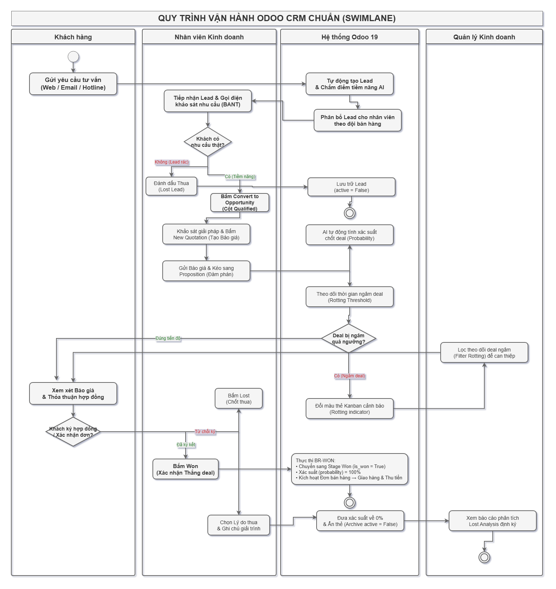
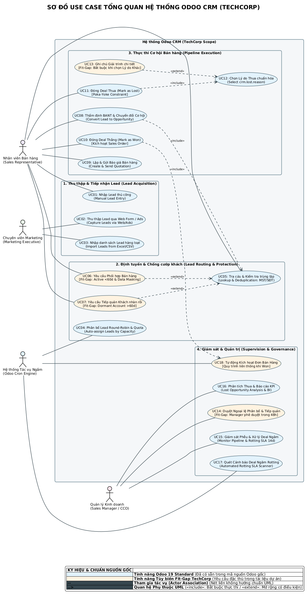

# Case Study: Enterprise Odoo ERP (CRM & Sales Engineering)

> **Interviewer Evaluation & Project Overview**  
> **Candidate:** Ha Duy Hung | **Role Focus:** Business Analyst (ERP & SaaS)  
> **Domain:** Enterprise B2B Sales, CRM Lifecycle, Lead Management & Revenue Forecasting  

---

## 📌 Executive Assessment (Góc nhìn Người Phỏng Vấn / Reviewer)

> *"Dự án này là minh chứng rõ nét cho năng lực phân tích nghiệp vụ thực chiến cấp độ Enterprise. Thay vì chỉ tiếp cận phần mềm ở góc độ cấu hình chức năng (Feature checklist), ứng viên đã giải quyết bài toán cốt lõi của Ban Giám đốc (CEO, CFO, CCO): từ tái cấu trúc dòng chảy khách hàng, giải quyết xung đột nội bộ bằng hệ thống, cho đến kiểm soát dòng tiền doanh nghiệp với mô hình doanh thu lai."*

### Điểm nhấn năng lực nổi bật:
1. **Tư duy Kiến trúc & Luồng nghiệp vụ (Business Process Modeling):** Xây dựng sơ đồ Swimlane 4 làn bơi và Flowchart quyết định phân bổ Lead tự động đạt chuẩn quốc tế.
2. **Kỷ luật hệ thống Poka-Yoke (System Constraint):** Triệt tiêu lỗi vận hành và hành vi "ngâm deal" từ cấp độ hệ thống thay vì quản lý bằng mệnh lệnh hành chính.
3. **Cân bằng giữa Vận hành & Bảo mật:** Giải quyết bài toán hóc búa "Chống cướp khách" vs "Chống trùng khách" giữa các chi nhánh B2B.

---

## 📂 1. What's Inside This Directory? (Thư mục này có gì?)

Cấu trúc thư mục được tinh gọn và tổ chức khoa học theo chuẩn bàn giao của Chuyên viên Phân tích Nghiệp vụ (BA Deliverables):

```
odoo/
│
├── README.md                                          # Bản tổng kết & Đánh giá năng lực nghiệp vụ
│
├── diagram/                                           # Bộ sơ đồ quy trình trực quan (Visual Artifacts - High-Res PNG)
│   ├── CRM_Lead_To_Order_Swimlane_Process.png         # Sơ đồ Swimlane 4 làn bơi Lead-to-Order
│   ├── CRM_Auto_Assignment_Anti_Poaching_Flow.png      # Sơ đồ Quyết định Phân bổ Lead & Chống cướp khách
│   └── CRM_System_Use_Case_Overview.png               # Sơ đồ Use Case tổng quan hệ thống CRM
│
└── doc/                                               # Bộ tài liệu phân tích chi tiết & Case Study giải pháp
    ├── Business_Rules_Analysis.md                     # Cẩm nang 14 nhóm Quy tắc Nghiệp vụ cốt lõi
    ├── CRM_Architecture_ASCII.md                      # Bản đồ kiến trúc chức năng phân tầng Odoo CRM
    ├── CRM_Pain_Points.md                             # Ma trận bóc tách Điểm đau thực tế & Giải pháp
    ├── case.md                                        # Case Study M3: Quản trị Pipeline, Rotting SLA & Lost Reasons
    ├── case_module_4.md                               # Case Study M4: Phân bổ Lead Round-Robin & Bảo mật 3 cấp
    ├── case_module_5.md                               # Case Study M5: Doanh thu lai (MRR/One-off) & Slipping Deals
    ├── BA_Master_Learning_Plan.md                     # Khung lộ trình học tập & phương pháp phân tích BA
    ├── CRM_Learning_Progress.md                       # Nhật ký tiến độ và bảng đánh giá năng lực
    └── Learning_Checklist.md                          # Bảng kiểm soát checklist kỹ năng BA
```

---

## 🛠️ 2. What Was Accomplished? (Đã làm gì?)

### 1. Chuẩn hóa & Mô hình hóa Quy trình Nghiệp vụ (Process Modeling)
* **Lead-to-Order Swimlane (4 làn bơi):** Phân định ranh giới trách nhiệm rõ ràng giữa *Khách hàng*, *Nhân viên kinh doanh (Sales Rep)*, *Hệ thống tự động (Odoo Core)* và *Quản lý (Sales Manager / CCO)*.
* **Auto-Assignment & Anti-Poaching Decision Matrix:** Thiết lập thuật toán phân bổ Round-Robin, kiểm soát hạn mức ngày (Quota = 5 leads/ngày) và điều kiện xử lý nhân sự nghỉ phép (Leave/Time Off).
* **CRM Enterprise Use Case:** Phân tích 18 Use Case bao phủ 4 nhóm Actor với độ tách bạch giữa tính năng Chuẩn (Odoo Standard) và giải pháp May đo (Fit-Gap Customization).

### 2. Xây dựng Cẩm nang 14 Quy tắc Nghiệp vụ (Business Rules Framework)
* Đặc tả chi tiết 14 nhóm quy tắc cốt lõi: Ràng buộc tính hợp lệ dữ liệu (Validation Rules), Công thức tính toán (Computed Values), Ma trận bảo mật phân quyền 3 cấp (Access Security), Luồng phê duyệt (Approval Workflows) và Tự động hóa leo thang cảnh báo (Automated Escalation).

### 3. Giải quyết 3 Bài toán Tình huống Thực tế từ C-Level (Case Studies)

| Case Study | Nỗi đau Quản trị (Pain Point) | Giải pháp của BA | Giá trị Đạt được |
| :--- | :--- | :--- | :--- |
| **Case M3: Pipeline & Rotting SLA** (`case.md`) | Sales ngâm deal quá hạn làm sai lệch dự báo doanh thu; bấm nút Lost bừa bãi không rõ lý do. | • Kích hoạt Rotting Threshold (14 ngày cảnh báo đổi màu Kanban).<br>• Ràng buộc Poka-Yoke bắt buộc chọn Lost Reason có cấu trúc. | 100% deal thua có nguyên nhân; CCO phát hiện điểm nghẽn tức thì trên Kanban. |
| **Case M4: Sales Team & Anti-Poaching** (`case_module_4.md`) | Sales tranh cướp lead B2C; sales B2B giấu thông tin khách vào sổ tay vì sợ mất khách nội bộ. | • Phân bổ Round-Robin tự động + Quota 5 lead/ngày.<br>• Ma trận phân quyền 3 cấp + Che số điện thoại (Data Masking) chống cướp khách. | Triệt tiêu tranh chấp nội bộ; bảo vệ tài sản dữ liệu khi nhân sự nghỉ việc. |
| **Case M5: Hybrid Revenue & Slipping Deals** (`case_module_5.md`) | Hợp đồng hỗn hợp vừa bán đứt (One-off) vừa thuê bao (MRR); sales kéo deal né KPI làm vỡ dòng tiền. | • Tách biệt trường One-off vs Recurring Revenue.<br>• Bộ đếm dời deal (`reschedule_count >= 2`) tự động bật cờ Slipping Flag. | CFO dự báo chính xác thanh khoản; CEO nắm bắt tăng trưởng New MRR thời gian thực. |

---

## 💡 3. Key Insights & Business Value (Mang lại Insight gì?)

### 🔹 Insight 1: Dùng Kỷ luật Hệ thống (Poka-Yoke) thay vì Mệnh lệnh Hành chính
Trong quản trị doanh nghiệp, nhắc nhở bằng lời nói thường không hiệu quả. Giải pháp BA xây dựng các rào chắn kỹ thuật (System Constraints) trực tiếp trên phần mềm: khóa nút chuyển trạng thái nếu thiếu trường bắt buộc, tự động đổi màu thẻ Kanban khi trễ SLA. Điều này giúp doanh nghiệp vận hành tự động, chuẩn hóa dữ liệu đầu vào mà không tạo thêm áp lực giám sát thủ công cho cấp quản lý.

### 🔹 Insight 2: Cân bằng Tinh tế giữa "Vận hành Mở" và "Bảo mật Dữ liệu"
Một bài toán kinh điển trong CRM: Nếu khóa quyền hoàn toàn, nhân viên sẽ tạo trùng khách hàng và giẫm chân nhau; nếu mở quyền xem tự do, nhân sự sẽ nhìn trộm báo giá và cướp khách của đồng nghiệp. Bằng cách áp dụng **Data Masking (Che số điện thoại/email)** và **Ma trận phân quyền 3 cấp (Own / Team / All)**, hệ thống vừa giúp sales nhận biết khách hàng đã tồn tại trên hệ thống, vừa ngăn chặn tuyệt đối nguy cơ cướp khách.

### 🔹 Insight 3: Minh bạch Hóa Dòng tiền & Dự báo Tài chính Đa chiều
Mô hình doanh thu SaaS/B2B hiện đại đòi hỏi góc nhìn tài chính phân tầng. Việc tách bạch giữa dòng tiền thu ngay 1 lần (One-off) và doanh thu định kỳ tích lũy (MRR/ARR) cho phép Ban Giám đốc lên kế hoạch chi phí và tuyển dụng chính xác. Hơn thế nữa, tính năng phát hiện "Deal trôi dạt" (Slipping Deals Indicator) giúp doanh nghiệp cứu vãn kịp thời những cơ hội có nguy cơ đổ vỡ trước khi quá muộn.

---

## 🖼️ Visual Artifacts (Xem nhanh các Sơ đồ Nghiệp vụ)

### 1. Sơ đồ Quy trình Vòng đời Bán hàng (Lead-to-Order Swimlane)


### 2. Sơ đồ Quyết định Phân bổ Lead & Chống Cướp Khách (Decision Flow)


### 3. Sơ đồ Use Case Tổng quan Hệ thống CRM (System Scope & Capabilities)


---

> 🔗 **Điều hướng tài liệu chi tiết:**  
> Xem các bản đặc tả nghiệp vụ hoàn chỉnh tại thư mục [./doc/](./doc/)  
> Quay trở lại trang hồ sơ cá nhân: [Root Portfolio README](../README.md)
