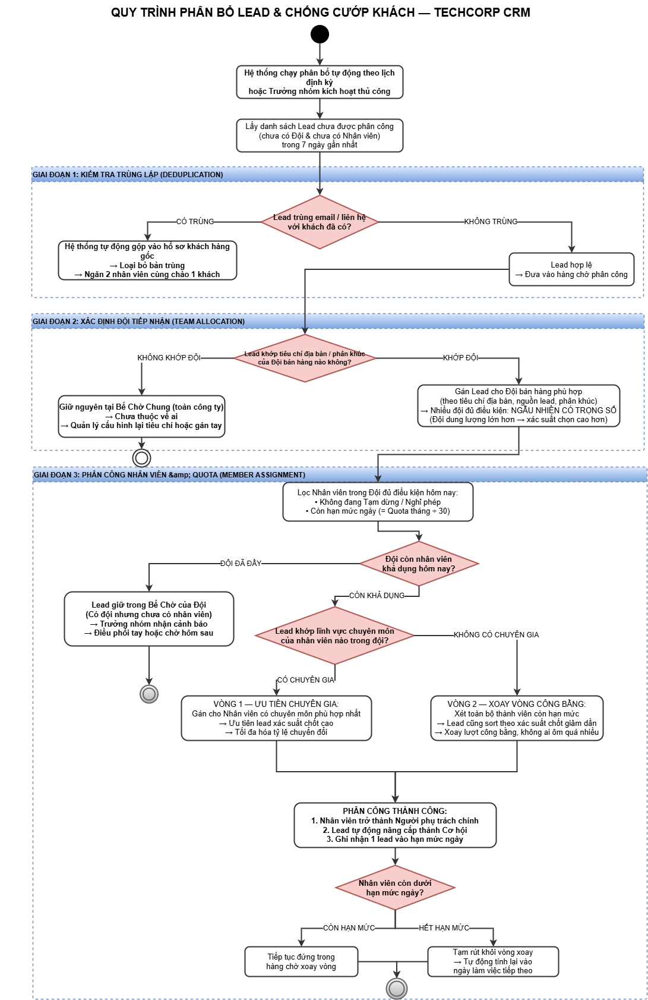

# ĐẶC TẢ GIẢI PHÁP NGHIỆP VỤ: TỔ CHỨC ĐỘI BÁN HÀNG, PHÂN BỔ TỰ ĐỘNG & BẢO MẬT DỮ LIỆU KHÁCH HÀNG

> **Dự án:** Tư vấn & Triển khai Odoo CRM (TechCorp)  
> **Phân hệ:** Odoo CRM (v19.0)  
> **Chủ đề:** Sales Teams, Rule-based Assignment, Security Matrix & Anti-poaching  
> **Tác giả:** Lead Business Analyst (BA Leader)  
> **Người tiếp nhận:** Giám đốc Kinh doanh (CCO) & Ban Quản trị Dự án  
> 
> 📌 **Tài liệu liên quan:** [ba_teaching_rules.md](file:///e:/BA/Ba-case/odoo/odoo/.agents/rules/ba_teaching_rules.md) | [Business_Rules_Analysis.md](file:///e:/BA/Ba-case/odoo/odoo/doc/Business_Rules_Analysis.md) | [CRM_Learning_Progress.md](file:///e:/BA/Ba-case/odoo/odoo/doc/CRM_Learning_Progress.md)

---

## 1. TỔNG QUAN HIỆN TRẠNG & NỖI ĐAU QUẢN TRỊ (AS-IS PAIN POINTS)

Doanh nghiệp vận hành 2 mô hình kinh doanh song song với 50 nhân sự bán hàng, đối mặt với 3 điểm nghẽn nghiêm trọng:
1. **Khối B2C (Website/Digital):** Lead đổ về hòm thư chung, nhân viên tranh giành lead thủ công, người ôm quá nhiều (30 lead/ngày) gây trễ cam kết SLA gọi khách trong 15 phút, người mới thì đói lead. Nhân viên nghỉ phép vẫn bị gán lead làm nguội khách.
2. **Khối B2B (Dự án theo vùng miền):** Trưởng phòng Miền Bắc và Miền Nam tranh chấp khách hàng doanh nghiệp; nhân viên nơm nớp sợ bị cướp khách nên ghi số điện thoại vào sổ tay cá nhân; rủi ro nhân sự nghỉ việc xóa sạch cơ hội hoặc xuất file Excel mang sang đối thủ.
3. **Mâu thuẫn bảo mật vs vận hành:** Khóa quyền xem khách thì nhân viên tạo trùng khách hàng (2 sales cùng chào 1 đối tác); mở quyền xem thì nhân viên nhìn trộm thông tin liên hệ và báo giá của đồng nghiệp.

---

## 2. GIẢI PHÁP BÀI TOÁN 1: CƠ CHẾ PHÂN BỔ LEAD TỰ ĐỘNG KHỐI B2C (AUTO-ASSIGNMENT)

### 2.1. Cơ chế xoay vòng Round-Robin công bằng
* `[CHUẨN ODOO STANDARD]`
  * Kích hoạt tính năng **Rule-based Assignment** tại menu *CRM $\rightarrow$ Configuration $\rightarrow$ Settings*.
  * Thiết lập Đội bán hàng: Tạo đội **"B2C Website & Digital"** tại *CRM $\rightarrow$ Configuration $\rightarrow$ Sales Teams*.
  * Tại tab *Assignment Rules*, thêm danh sách nhân viên kinh doanh và bật tính năng phân bổ tự động. Hệ thống sử dụng thuật toán xoay vòng Round-Robin: Chia lần lượt cho từng thành viên trong hàng đợi, khi đến người cuối cùng sẽ tự động quay trở lại đầu danh sách.

### 2.2. Kiểm soát hạn mức tiếp nhận (Capacity Quota = 5 lead/ngày)
* `[CHUẨN ODOO STANDARD]`
  * Trên từng dòng thành viên của Đội ngũ (*Sales Team Members*), thiết lập trường:
    $$\text{Lead Capacity (assignment\_max)} = 150 \text{ (leads / 30 days)}$$
  * **Cơ chế vận hành thực tế:** Odoo tính hạn mức ngày theo công thức `quota = assignment_max ÷ 30` (làm tròn). Với TechCorp thiết lập `assignment_max = 150`, quota mỗi ngày = **5 lead/ngày**. Nhân viên nào đã đạt đủ 5 lead sẽ tự động bị bỏ qua khỏi vòng quay và nhường lượt cho nhân sự tiếp theo còn chỉ tiêu.
  * > **📌 Lưu ý kỹ thuật BA:** Mặc định Odoo là `assignment_max = 30` (≈ 1 lead/ngày). Con số **5 lead/ngày** là thiết lập riêng của TechCorp, không phải hằng số Odoo gốc.

### 2.3. Xử lý 2 Tình huống ngoại lệ (Edge Cases)
* **Ngoại lệ A – Nhân viên nghỉ phép (Leave/Time Off):**
  * `[CHUẨN ODOO STANDARD]`: Trên dòng thành viên Đội ngũ có sẵn cờ **Pause Assignment (Tạm dừng nhận lead)**.
  * `[GIẢ ĐỊNH NGHIỆP VỤ / TÙY BIẾN FIT-GAP]`: Tự động hóa liên kết: Khi đơn nghỉ phép của nhân viên được phê duyệt trên phân hệ **Time Off**, hệ thống tự động tích chọn cờ *Pause Assignment*. Khi hết ngày nghỉ, hệ thống tự động gỡ cờ để nhân viên quay lại hàng chờ.
* **Ngoại lệ B – Toàn đội chạm trần 5 lead/ngày (Over-capacity Pool):**
  * `[CHUẨN ODOO STANDARD]`: Khi toàn bộ thành viên đều đạt hạn mức ngày (quota = 0), các lead mới phát sinh vẫn được gán vào Đội bán hàng B2C, nhưng trường **Người phụ trách (Salesperson)** sẽ để **TRỐNG (Unassigned)** — hành vi này do điều kiện `if not members_to_assign: continue` trong code gốc.
  * `[GIẢ ĐỊNH NGHIỆP VỤ / TÙY BIẾN FIT-GAP]`: 
    * **Cảnh báo vượt ngưỡng:** Kích hoạt *Automated Action* gửi thông báo khẩn lên kênh Chatter cho Trưởng nhóm B2C: *"Đội ngũ đã hết quota nhận lead trong ngày, hiện có [X] lead đang chờ điều phối!"*.
    * **Điều phối linh hoạt:** Trưởng nhóm có quyền gán bổ sung cho những nhân sự xuất sắc đã xử lý xong 5 lead đầu tiên, hoặc điều chuyển chi viện sang ca chiều/đội phụ trách khác.
    * **Lead ngoài giờ:** Lead phát sinh ban đêm được giữ trong hàng chờ (Queue), đúng 08h00 sáng hôm sau hệ thống tự động ưu tiên phân bổ trước cho ca làm việc mới.

---

## 3. GIẢI PHÁP BÀI TOÁN 2: MA TRẬN PHÂN QUYỀN BẢO MẬT KHỐI B2B

### 3.1. Ma trận phân quyền theo 3 cấp vai trò (Role Matrix)

| Chức danh doanh nghiệp | Cấp độ phân quyền Odoo | Phạm vi nhìn thấy dữ liệu (`crm.lead` & `res.partner`) | Quyền thao tác |
| :--- | :--- | :--- | :--- |
| **Salesman B2B** | `User: Own Documents Only` | **Chỉ nhìn thấy tài liệu của chính mình** (`user_id = me`). Tuyệt đối không thấy deal của đồng nghiệp cùng đội hay đội khác. | Xem, Tạo mới, Sửa cơ hội của mình. **CẤM Xóa, CẤM Export**. |
| **Trưởng phòng B2B (Miền Bắc / Nam)** | `User: Team Documents Only` | **Chỉ nhìn thấy tài liệu của các thành viên trong Đội mình làm Leader**. Trưởng phòng Miền Bắc không thấy dữ liệu Miền Nam và ngược lại. | Xem, Sửa, Tái phân bổ deal trong đội. **CẤM Xóa, CẤM Export**. |
| **Giám đốc Kinh doanh (CCO)** | `Administrator: All Documents` | **Toàn quyền nhìn thấy 100% dữ liệu toàn quốc** của tất cả các đội B2B Miền Bắc, Miền Nam và B2C. | Toàn quyền cấu hình, phê duyệt, phân tích báo cáo cấp tập đoàn. |

### 3.2. Chống thất thoát dữ liệu khi nhân sự nghỉ việc
* `[CHUẨN ODOO STANDARD]`
  * **Chặn quyền Xóa (Anti-Delete):** Tại phân quyền nhóm (*Access Rights*), loại bỏ hoàn toàn quyền **Delete** trên bảng Cơ hội (`crm.lead`) và Khách hàng (`res.partner`) đối với cấp độ `User`. Khi nhân viên muốn hủy deal, họ chỉ được chuyển trạng thái sang **Lost (Thất bại)** kèm lý do cụ thể.
  * **Khóa tính năng Xuất Excel (Anti-Export):** Trong nhóm quyền hệ thống, gỡ bỏ người dùng kinh doanh khỏi nhóm **"Export Excel / Allow Download"**. Nút xuất dữ liệu hàng loạt sẽ biến mất hoàn toàn trên giao diện danh sách của sales.

---

## 4. GIẢI PHÁP BÀI TOÁN 3: "CHỐNG CƯỚP KHÁCH" VS "CHỐNG TRÙNG KHÁCH"

> 📊 **Sơ đồ Quyết định chi tiết:** [Sơ đồ Phân bổ Lead & Chống cướp khách (PNG)](../diagram/CRM_Auto_Assignment_Anti_Poaching_Flow.png)



Đây là giải pháp Fit-Gap cốt lõi kết hợp giữa **Công nghệ che dữ liệu (Data Masking)** và **Quy chế kiểm soát nội bộ (Internal Control)**:

```
                          [Sales A tiếp cận khách hàng mới]
                                         │
                                         ▼
                      [BƯỚC 1: NHẬP MÃ SỐ THUẾ (MST) / SĐT]
                                         │
                   ┌─────────────────────┴─────────────────────┐
                   ▼                                           ▼
          [MST CHƯA TỒN TẠI]                           [MST ĐÃ TỒN TẠI]
                   │                                           │
                   ▼                                           ▼
      [HỆ THỐNG HIỆN TICK XANH]                   [BƯỚC 2: CHẶN TẠO TRÙNG]
       "Khách hàng hợp lệ,                        Hệ thống chỉ hiện cửa sổ an toàn:
      được phép tạo mới 100%"                     • Tên: Cty Cổ phần An Phát
                   │                              • Phụ trách: Nguyễn Văn B (Đội Nam)
                   ▼                              • Trạng thái: Đang đàm phán hợp đồng
          [TẠO DEAL THÀNH CÔNG]                   • SĐT & Email: ĐÃ BỊ CHE (0908.***.***)
                                                  • Khóa click xem chi tiết deal
                                                               │
                                                               ▼
                                                  [BƯỚC 3: KIỂM TRA CHÍNH SÁCH QUẢN TRỊ]
                                                               │
                             ┌─────────────────────────────────┴─────────────────────────────────┐
                             ▼                                                                   ▼
                 [TRƯỜNG HỢP 1: KHÁCH ACTIVE]                                        [TRƯỜNG HỢP 2: KHÁCH BỎ RƠI]
                 • Sales B đang chăm sóc dưới 60 ngày                                • Không tương tác > 60 ngày
                 • Sales A KHÔNG ĐƯỢC tự ý liên hệ                                   • HOẶC đã Lost > 90 ngày
                 • Muốn cùng chào thêm sản phẩm B2C:                                 • Hệ thống gắn cờ: "Dormant Account"
                   Bấm nút "Yêu cầu phối hợp (Co-sell)"                              • Sales A được bấm:
                   gửi Trưởng phòng Sales B duyệt chia hoa hồng.                       "Yêu cầu thu hồi & Tiếp quản".
```

### 4.1. Bộ khóa nhận diện duy nhất (Unique Identifiers)
* **Khách hàng B2B:** Sử dụng **Mã số thuế (Tax ID)** làm khóa định danh duy nhất (Primary Key).
* **Khách hàng B2C:** Sử dụng **Số điện thoại di động chính (Mobile)** làm khóa định danh.

### 4.2. Màn hình tra cứu an toàn & Mặt nạ dữ liệu (Data Masking)
* `[GIẢ ĐỊNH NGHIỆP VỤ / TÙY BIẾN FIT-GAP]`
  * Cung cấp một thanh công cụ tra cứu nhanh trước khi tạo khách.
  * Nếu trùng lặp: Trả về trạng thái đã có người chăm sóc, nhưng **che 100% dữ liệu nhạy cảm**:
    * Số điện thoại: `0908.***.***`
    * Email: `c*****@anphat.com`
    * Ẩn giá trị doanh thu kỳ vọng, không cho mở Form View của cơ hội.

### 4.3. Quy chế "Khách hàng nhàn rỗi" (Dormant Account / Lead Recycling Policy)
* **Định nghĩa khách bỏ rơi:** Khách hàng được tạo nhưng **quá 60 ngày liên tục không phát sinh bất kỳ tương tác nào** (không cuộc gọi, không lịch hẹn, không báo giá) HOẶC đã bị đánh dấu **Lost quá 90 ngày**.
* **Cơ chế thu hồi công bằng:** Hệ thống tự động chuyển khách hàng sang trạng thái *Dormant*. Nhân viên khác khi tra cứu ra khách này sẽ được quyền bấm nút **"Thu hồi & Tiếp quản quyền chăm sóc"**. Khi bấm nút, hệ thống tự động gửi thông báo cho Quản lý phê duyệt chuyển giao trong 24 giờ.

---

## 5. BỘ ĐẶC TẢ YÊU CẦU CHUẨN BA (USER STORIES & ACCEPTANCE CRITERIA)

### 📌 User Story 1: Tra cứu an toàn & Chặn trùng lặp khách hàng
* **Là một:** Nhân viên kinh doanh B2B (Salesman)
* **Tôi muốn:** Khi tôi nhập Mã số thuế của một doanh nghiệp mới, hệ thống kiểm tra và cảnh báo nếu doanh nghiệp này đã tồn tại trên hệ thống nhưng không để lộ số điện thoại cá nhân của khách hàng.
* **Để tôi:** Không tiếp cận trùng khách hàng với đồng nghiệp, bảo vệ tính chuyên nghiệp của công ty mà không phát sinh nguy cơ cướp khách.

#### Tiêu chí nghiệm thu (Acceptance Criteria - AC 1):
* **Given (Bối cảnh):** Khách hàng "Công ty Cổ phần An Phát" có MST `0101234567` đã được nhân viên Nguyễn Văn B tạo và đang theo đuổi.
* **When (Hành động):** Nhân viên Trần Văn A nhập MST `0101234567` vào màn hình tạo khách hàng mới.
* **Then (Kết quả mong đợi):**
  1. Hệ thống hiển thị thông báo: *"Khách hàng đã tồn tại trên hệ thống và đang được phụ trách bởi Nguyễn Văn B (Đội B2B Miền Nam)"*.
  2. Nút "Lưu / Tạo mới" bị vô hiệu hóa (disabled).
  3. Trường Số điện thoại hiển thị dưới dạng che mặt nạ: `0908.***.***`.
  4. Trần Văn A không có quyền click mở xem chi tiết cơ hội của Nguyễn Văn B.

---

### 📌 User Story 2: Tái phân bổ khách hàng bị bỏ rơi (Lead Recycling)
* **Là một:** Nhân viên kinh doanh (Salesman)
* **Tôi muốn:** Có thể gửi yêu cầu tiếp quản một khách hàng doanh nghiệp nếu khách hàng đó đã bị người phụ trách cũ bỏ rơi quá 60 ngày không chăm sóc.
* **Để tôi:** Khai thác lại nguồn dữ liệu khách hàng tiềm năng cũ, gia tăng doanh số cho công ty và tránh lãng phí tài nguyên.

#### Tiêu chí nghiệm thu (Acceptance Criteria - AC 2):
* **Given (Bối cảnh):** Khách hàng "Công ty TNHH Sao Mai" thuộc sở hữu của Sales C nhưng không có bất kỳ hoạt động (`mail.activity`) nào trong suốt 65 ngày qua.
* **When (Hành động):** Sales D tra cứu MST của Công ty Sao Mai và bấm nút *"Yêu cầu thu hồi & Tiếp quản"*.
* **Then (Kết quả mong đợi):**
  1. Hệ thống tạo một thông báo duyệt phê duyệt gửi trực tiếp cho Trưởng phòng kinh doanh của Sales C trên Chatter.
  2. Nếu Trưởng phòng bấm "Đồng ý" (hoặc sau 48 giờ không phản hồi): Trường `user_id` của khách hàng được tự động đổi sang Sales D.
  3. Lịch sử chuyển quyền được ghi nhận minh bạch vào Chatter kiểm toán (Audit Trail).

---

## 6. BẢNG TỔNG HỢP FIT-GAP MATRIX CHO DỰ ÁN TECHCORP

| STT | Nghiệp vụ đề xuất | Đánh giá Fit-Gap | Phương án triển khai |
| :---: | :--- | :---: | :--- |
| **1** | Phân bổ Round-Robin theo hạn mức 5 lead/ngày | `[CHUẨN ODOO STANDARD]` | Cấu hình trong *CRM Settings* & *Sales Team Members*. Không cần code. |
| **2** | Tự động tạm dừng nhận lead khi duyệt nghỉ phép | `[GIẢ ĐỊNH / TÙY BIẾN FIT-GAP]` | Cấu hình No-code *Automated Action* liên kết module *Time Off* và *CRM Team Member*. |
| **3** | Phân quyền 3 cấp (Sales, Leader, CCO) | `[CHUẨN ODOO STANDARD]` | Ánh xạ chuẩn vào các nhóm quyền CRM: `Own`, `Team`, `All Documents`. |
| **4** | Chặn quyền Xóa và Chặn Xuất file Excel | `[CHUẨN ODOO STANDARD]` | Cấu hình phân quyền trong *Settings $\rightarrow$ Users & Companies $\rightarrow$ Groups*. |
| **5** | Tra cứu check trùng theo MST / SĐT | `[CHUẨN ODOO STANDARD]` | Kích hoạt thuộc tính cảnh báo trùng lặp (*Contact Duplicate Alert*) trên Odoo. |
| **6** | Mặt nạ dữ liệu (Data Masking) ẩn SĐT | `[GIẢ ĐỊNH / TÙY BIẾN FIT-GAP]` | Thiết lập thuộc tính hiển thị che trường (Widget / Studio No-code) cho cấp độ Salesman. |
| **7** | Chính sách thu hồi khách bỏ rơi sau 60 ngày | `[GIẢ ĐỊNH / TÙY BIẾN FIT-GAP]` | Thiết lập luồng Scheduled Action quét tự động các deal không có tương tác > 60 ngày để chuyển cờ *Dormant*. |

---

## 7. KẾT LUẬN & ĐỀ XUẤT HÀNH ĐỘNG CHO CCO
Bản thiết kế trên giải quyết triệt để cả 3 nỗi đau quản trị:
1. **Triệt tiêu tranh chấp nội bộ:** Phân bổ tự động minh bạch 100%, không ai có thể "chộp giật" hay "ôm đồm" quá 5 lead/ngày.
2. **Bảo vệ tài sản số công ty:** Phân quyền cách ly theo địa bàn, không cho phép xóa và chặn đứng nguy cơ tải danh bạ khách hàng mang đi.
3. **Cân bằng hoàn hảo giữa bảo mật và vận hành:** Chặn trùng lặp tuyệt đối qua MST nhưng bảo vệ thông tin liên hệ bằng mặt nạ dữ liệu, đồng thời tối ưu hóa doanh thu thông qua chính sách tái sử dụng khách hàng bỏ rơi.
