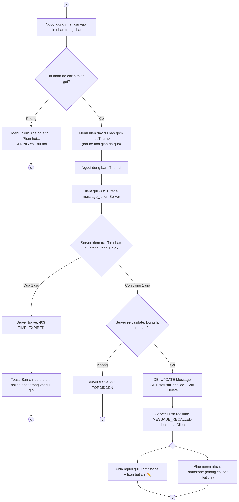
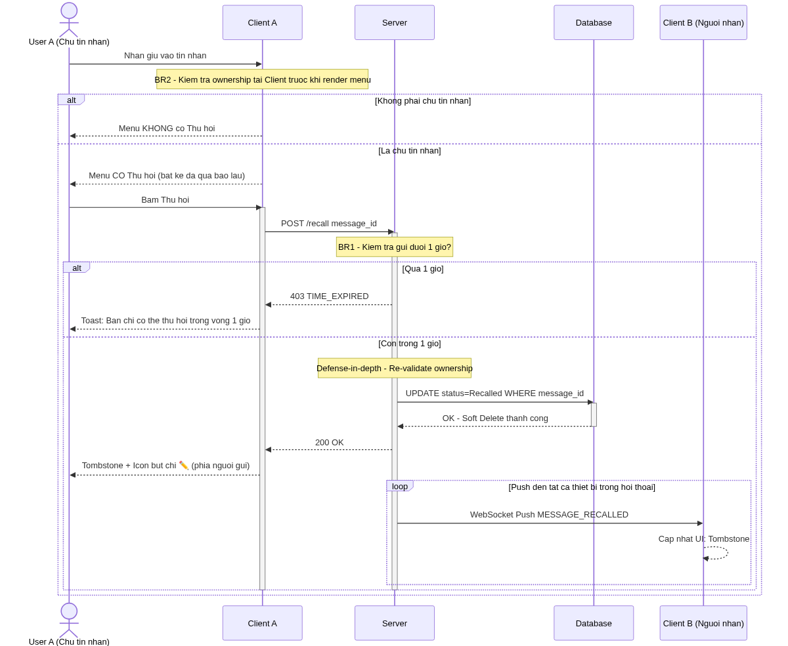
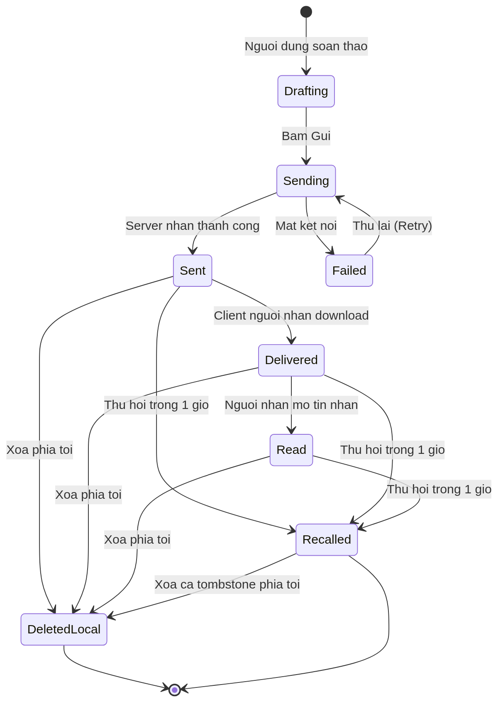

# Nghien Cuu Tinh Huong: Phan Tich Tinh Nang "Thu Hoi Tin Nhan" va Nguyen Ly Soft Delete — Zalo

> Ung vien: **Ha Duy Hung** — Business Analyst, Mobile Product & Security / Privacy  
> Phuong phap: Reverse Engineering Logic (Black-box Testing), Business Rules Extraction, Defense-in-Depth Analysis  
> Pham vi: Boc tach 4 Business Rules cot loi an sau nut "Thu hoi", xac dinh Pain Points nguoi dung va de xuat cai tien trai nghiem  

---

## 1. Project Context

| Hang muc | Chi tiet |
| :--- | :--- |
| **Don vi nghiep vu** | Zalo (VNG Corporation) — Nen tang nhan tin va lien lac OTT hang dau Viet Nam (>75 trieu MAU) |
| **Loai du an** | Product Feature Analysis — UX Improvement & Business Rules Documentation |
| **Phan he muc tieu** | Tinh nang Thu hoi tin nhan (Message Recall) trong hoi thoai ca nhan 1-1 va nhom |
| **Thoi gian thuc hien** | Nghien cuu thuc nghiem (black-box testing), phan tich hanh vi va thiet ke giai phap trong 1 tuan |
| **Stakeholders lien quan** | Nguoi dung cuoi (End-users), Product Owner / BA Zalo, Ky su Backend & Mobile, Trust & Safety Team |
| **Phuong phap tiep can** | Black-box Reverse Engineering (kiem thu thuc nghiem tren thiet bi that), Competitor Benchmark (Telegram, WhatsApp, Signal, LINE), tham chieu help.zalo.me |
| **Ket qua ban giao** | 4 Business Rules hien hanh, 2 Pain Points co nguon goc, 4 Business Requirements de xuat, 3 So do ky thuat (Flowchart, Sequence, State Diagram), Bo nguon tai lieu tham chieu 3 tang |

---

## 2. Business Problem Statement

Tinh nang "Thu hoi tin nhan" cua Zalo co giao dien tac dong don gian — nhan giu tin nhan, chon "Thu hoi" — nhung che may xu ly ben trong phuc tap hon nhieu so voi thiet ke UI the hien. **Su phuc tap bi an nay tao ra 2 loai van de:**

### Van de 1 — Rao can nhan thuc nguoi dung (PP1)

> Nut "Thu hoi" van hien thi voi moi tin nhan cua minh du da gui tu rat lau. Nguoi dung thuong nham tuong rang ho co the thu hoi bat cu luc nao, dan den that vong khi bi tu choi sau 1 gio gui.

- **Root Cause:** Viec check thoi gian duoc xu ly hoan toan o Server-side (khong phai Client), khien UI khong phan biet duoc tin nhan nao con co the thu hoi.
- **Business Impact:** Nguoi dung bi lo thong tin nhay cam va danh mat su tin tuong vao tinh nang bao mat cua ung dung.

### Van de 2 — Tombstone thieu kha nang phan biet (PP2)

> Ca nguoi gui lan nguoi nhan cung chi thay dong chu "Tin nhan da duoc thu hoi" — nhung nguoi gui nao thu hoi, thu hoi tin nhan nao cu nao trong cuoc tro chuyen dai, la khong ro rang.

- **Root Cause:** Thiet ke Tombstone hien tai chi danh dau trang thai ma khong cung cap nguon goc (thu hoi boi ai, luc may gio) de nguoi nhan hieu boi canh.
- **Business Impact:** Trong cac nhom chat cong viec, tin nhan thu hoi co the gay hieu nham ve muc dich va tao ma sat khong can thiet.

---

## 3. Business Rules Hien Hanh (As-Is)

Bon Business Rule duoc rut ra qua kiem thu thuc nghiem (black-box testing) tren Zalo iOS va Android, ket hop doi chieu voi help.zalo.me:

### BR1 — Gioi Han Thoi Gian (Validation — Server-side)

| Tieu chi | Chi tiet |
| :--- | :--- |
| **Quy tac** | Chi co the thu hoi tin nhan gui trong **vong 1 gio (60 phut)** tinh tu thoi diem gui |
| **Vi tri xu ly** | **Server-side** — Client khong co logic check thoi gian |
| **Hau qua neu vi pham** | Server tra ve loi, Client hien Toast: *"Ban chi co the thu hoi tin nhan trong vong 1 gio"* |
| **Diem dac biet** | Nut "Thu hoi" **van hien thi** du da qua 1 gio — chi bi tu choi khi thuc su bam vao |
| **Ly do thiet ke** | Tranh viec Client phai chay ngam timer dem nguoc cho hang ngan tin nhan (hao pin, ton tai nguyen) |
| **Nguon xac nhan** | help.zalo.me — muc "Thu hoi tin nhan"; kiem thu thuc nghiem |

### BR2 — Phan Quyen So Huu (Authorization — Client-side + Server-side)

| Tieu chi | Chi tiet |
| :--- | :--- |
| **Quy tac** | Chi nguoi gui moi co quyen thu hoi tin nhan cua chinh minh |
| **Vi tri xu ly (lop 1)** | **Client-side**: Neu la tin nhan nguoi khac, menu ngu canh hoan toan **khong hien thi** nut "Thu hoi" |
| **Vi tri xu ly (lop 2)** | **Server-side**: Re-validate de chong API gia mao (defense-in-depth) |
| **Hieu qua** | Giao dien gon gang; ngan chan ca bypass qua UI lan bypass qua API call truc tiep |
| **Nguon xac nhan** | Kiem thu thuc nghiem (thu thu hoi tin nhan nguoi khac); thiet ke defense-in-depth la tieu chuan bao mat OWASP |

### BR3 — Dong Bo Trang Thai (Synchronization — Soft Delete + Realtime Push)

| Tieu chi | Chi tiet |
| :--- | :--- |
| **Quy tac** | Khi thu hoi thanh cong, trang thai tin nhan duoc cap nhat tren DB va push realtime den tat ca thiet bi |
| **Co che DB** | `UPDATE Message SET status = 'Recalled'` — **Soft Delete**, khong xoa vat ly (hard delete) |
| **Ly do Soft Delete** | Bao toan tinh toan ven du lieu (audit log, xu ly tranh chap); dam bao dong bo trang thai |
| **Co che Push** | Zalo push su kien `MESSAGE_RECALLED` qua WebSocket (realtime) den tat ca client dang dang nhap |
| **Ket qua tren Client** | Noi dung tin nhan goc bi thay the bang **Tombstone**: *"Tin nhan da duoc thu hoi"* o ca 2 phia |
| **Nguon xac nhan** | Kiem thu thuc nghiem; nguyen ly Soft Delete trong distributed systems |

### BR4 — Minh Bach & Trai Nghiem (Transparency & UX — Observation)

| Tieu chi | Chi tiet |
| :--- | :--- |
| **Phan loai** | *Observation thuc nghiem (chua co tai lieu chinh thuc xac nhan)* |
| **Hien tuong quan sat** | Phia **nguoi gui** sau khi thu hoi: Tombstone kem them **Icon but chi ✏️** |
| **Chuc nang icon** | Bam vao icon but chi: noi dung tin nhan cu **hien thi lai tren khung soan thao** de nguoi gui chinh sua va gui lai |
| **Insight nguoi dung** | Thu hoi thuong do go sai chu hoac thieu y — icon but chi tiet kiem cong go lai toan bo |
| **Phia nguoi nhan** | Chi hien Tombstone thuan tuy, khong co icon but chi |

---

## 4. Pain Points & Root Cause Analysis

### PP1 — Rao Can Nhan Thuc: Nguoi Dung Khong Biet Thoi Han 1 Gio

**Bieu hien:** Nguoi dung thuong phat hien khong the thu hoi sau khi da qua 1 gio, trong khi nut "Thu hoi" van hien thi binh thuong.

**5 Whys:**
1. *Tai sao nguoi dung bi that vong?* → Bam "Thu hoi" nhung bi tu choi.
2. *Tai sao bi tu choi?* → Tin nhan da gui qua 1 gio — vi pham BR1.
3. *Tai sao nguoi dung khong biet thoi han?* → UI khong co dau hieu phan biet tin nhan "con thu hoi duoc" va "het han".
4. *Tai sao UI khong phan biet?* → Logic check thoi gian nam hoan toan o Server, Client khong co thong tin nay.
5. *Tai sao khong day thong tin thoi gian xuong Client?* → Tranh hao tai nguyen (timer chay ngam) — day la quyet dinh toi uu hieu nang, nhung tao ra UX gap.

**Business Impact:** Giam tin tuong vao tinh bao mat cua ung dung; nguoi dung co the chia se thong tin nhay cam ma khong biet goi han thu hoi.

---

### PP2 — Tombstone Thieu Nguon Goc trong Nhom Chat

**Bieu hien:** Trong nhom chat nhieu nguoi, khi co "Tin nhan da duoc thu hoi" xuat hien, cac thanh vien khac khong biet: ai thu hoi? Thu hoi tin nhan nao? Luc may gio?

**5 Whys:**
1. *Tai sao gay hieu nham?* → Tombstone chi hien text thuan tuy, khong co context.
2. *Tai sao khong co context?* → Thiet ke Tombstone hien tai chi bao hieu trang thai, khong luu metadata nguoi thuc hien.
3. *Tai sao khong luu metadata?* → Co the la quyet dinh thiet ke tu ban dau uu tien de gian va bao mat (an danh hanh dong thu hoi).
4. *Tai sao dieu nay thanh van de?* → Nhom chat cong viec co nhu cau kiem soat noi dung va minh bach hon 1-1.
5. *Ket qua?* → Tao ma sat giao tiep, giam hieu qua lam viec nhom.

**Business Impact:** Nguoi quan ly nhom mat kha nang kiem soat noi dung; thanh vien co the su dung tinh nang de tao hieu nham co chu y.

---

## 5. Business Requirements De Xuat (To-Be)

### BR-NEW-01 — Hien Thi Trang Thai Thu Hoi Ro Rang Tren UI
**Priority:** High  
**User Story:** Voi tu cach nguoi dung, toi muon biet tin nhan nao cua toi con co the thu hoi (con trong han 1 gio) de chu dong ra quyet dinh dung han.  
**Acceptance Criteria:**
- Tin nhan duoc gui trong vong 1 gio truoc: Nut "Thu hoi" hien thi voi mau sac binh thuong
- Tin nhan het han thu hoi: Nut "Thu hoi" ghi ro "Thu hoi (het han)" hoac bi an di
- **Out-of-scope:** Khong bat Client chay timer dem nguoc cho tung tin nhan (qua ton tai nguyen)

### BR-NEW-02 — Tombstone Trong Nhom Co Thong Tin Nguoi Thu Hoi
**Priority:** Medium  
**User Story:** Voi tu cach thanh vien nhom chat, toi muon biet ai da thu hoi tin nhan de tranh hieu nham.  
**Acceptance Criteria:**
- Tombstone trong nhom hien thi: "*[Ten thanh vien] da thu hoi mot tin nhan*"
- Chat 1-1: Giu nguyen hien thi hien tai (minh bach theo lua chon)
- **Out-of-scope:** Khong hien thi noi dung tin nhan goc sau khi da thu hoi (vi pham muc dich tinh nang)

### BR-NEW-03 — Thong Bao Proactive Khi Gan Het Thoi Han Thu Hoi
**Priority:** Low  
**User Story:** Voi tu cach nguoi gui, toi muon nhan canh bao khi tin nhan sap het han thu hoi de tranh truong hop gui nham va khong kip sua.  
**Acceptance Criteria:**
- Sau khi gui 50 phut, hien thi canh bao nhe: "Tin nhan nay sap het han thu hoi (con 10 phut)"
- Co the tat tinh nang nay trong Settings

### BR-NEW-04 — Mo Rong Thoi Han Thu Hoi Linh Hoat (Co Phi)
**Priority:** Low  
**User Story:** Voi tu cach nguoi dung premium, toi muon co thoi gian thu hoi dai hon de xu ly cac truong hop khan cap.  
**Acceptance Criteria:**
- Goi Zalo Premium: Thoi han thu hoi tang len 24 gio
- **Out-of-scope:** Khong ap dung hoi to cho tin nhan gui truoc khi nang cap Premium

---

## 6. Giai Phap & Trong Pham Vi

### In-Scope (Co the thuc hien voi resource hien tai)
- Giu nut "Thu hoi" nhung them tooltip/badge chi ra thoi han con lai
- Thay doi Tombstone trong nhom chat de hien ten nguoi thu hoi
- Canh bao proactive 10 phut truoc khi het han

### Out-of-Scope (Can nghien cuu them / rui ro cao)
- Cho phep thu hoi sau 1 gio: Anh huong toan ven du lieu, doi chieu phap ly
- Cho phep xem noi dung tin nhan da thu hoi bang bat ky cach nao: Vi pham chinh sach quyen rieng tu

### So Sanh Competitor

| Ung dung | Gioi han thu hoi | Tombstone | UX dac biet |
| :--- | :--- | :--- | :--- |
| **Zalo** | 1 gio | "Tin nhan da duoc thu hoi" | Icon but chi phia nguoi gui |
| **Telegram** | Khong gioi han | "Message was deleted" | Khong hien ten ai xoa |
| **WhatsApp** | 60 gio | "This message was deleted" | Admin nhom xoa duoc tin nhan ca nguoi khac |
| **LINE** | 24 gio | "Message unsent" | Hien ten nguoi unsent trong nhom |
| **Signal** | Khong gioi han | "You deleted a message" | Phan biet xoa 1 phia / 2 phia |

---

## 7. So Do Ky Thuat

### Flowchart — Cay Quyet Dinh Thu Hoi

Luong quyet dinh day du tu khi nguoi dung nhan giu tin nhan den ket qua cuoi cung (thu hoi thanh cong / bi tu choi / khong co quyen).

[→ Xem so do: doc/thuhoi-diagrams.md#1-flowchart](./doc/thuhoi-diagrams.md)

---

### Sequence Diagram — Luong Ky Thuat End-to-End

Giao tiep chi tiet giua User → Client → Server → Database → Push den tat ca thiet bi. The hien ro 2 lop bao mat (Client authorization + Server re-validation) va co che Soft Delete + WebSocket Push.

[→ Xem so do: doc/thuhoi-diagrams.md#2-sequence-diagram](./doc/thuhoi-diagrams.md)

---

### State Diagram — Vong Doi Trang Thai Tin Nhan

Toan bo cac trang thai ma mot tin nhan Zalo co the di qua, lam noi bat su khac biet giua Soft Delete (Thu hoi — xoa ca 2 phia) va Local Delete (Xoa phia toi — chi xoa tren thiet bi nguoi gui).

[→ Xem so do: doc/thuhoi-diagrams.md#3-state-diagram](./doc/thuhoi-diagrams.md)

---

## 8. Tai Lieu Tham Khao & Doi Chieu Nguon

### Tang 1 — Nguon Chinh Thong Tu Zalo (VNG)

| Nguon | Noi dung xac nhan |
| :--- | :--- |
| [help.zalo.me — Thu hoi tin nhan](https://help.zalo.me/huong-dan/chuyen-muc/nhan-tin-va-goi/nhan-tin/thu-hoi-tin-nhan/) | Gioi han 1 gio; hien thi Tombstone ca 2 phia; phan biet Thu hoi vs Xoa phia toi |
| [help.zalo.me — Nhắn tin va goi](https://help.zalo.me/huong-dan/chuyen-muc/nhan-tin-va-goi/) | Bo quy tac tong the ve tinh nang nhan tin tren Zalo |
| [help.zalo.me — Chinh sach bao mat](https://help.zalo.me/huong-dan/chuyen-muc/bao-mat-va-rieng-tu/) | Cam ket quyen rieng tu cua Zalo voi du lieu nguoi dung |

### Tang 2 — Nguon Doi Chieu Ky Thuat

| Nguon | Noi dung biet thich |
| :--- | :--- |
| [Dien May Xanh — Cach thu hoi tin nhan Zalo](https://dienmayxanh.com/kinh-nghiem-hay/cach-thu-hoi-tin-nhan-tren-zalo-1364) | Xac nhan gioi han 1 gio; phan biet hanh vi Thu hoi vs Xoa |
| [Viettel Store — Huong dan thu hoi](https://viettelstore.vn/tin-tuc/cach-thu-hoi-tin-nhan-tren-zalo-don-gian-nhanh-chong.html) | Xac nhan Tombstone va co che push realtime |
| [The Gioi Di Dong — Tin nhan tu xoa Zalo](https://thegioididong.com) | Nguon doi chieu tinh nang lien quan (Tin nhan tu xoa) |

### Tang 3 — Nguon Nguyen Ly Ky Thuat Nganh

| Nguon | Ap dung vao case nay |
| :--- | :--- |
| OWASP — [Access Control Cheat Sheet](https://cheatsheetseries.owasp.org/cheatsheets/Access_Control_Cheat_Sheet.html) | Nguyen ly Defense-in-Depth (BR2): Validate o ca Client va Server |
| Martin Fowler — Patterns of Enterprise Application Architecture | Nguyen ly Soft Delete (BR3) trong he thong quy mo lon |
| Zalo Engineering Blog | Kien truc realtime messaging cua Zalo (tham khao chung) |

---

> Nguyen ban goc (bai dang LinkedIn + Sequence Diagram nguon drawio): `content.tex` va `diagram/thuhoi.drawio.xml`  
> Tac gia: Ha Duy Hung — [GitHub Portfolio](https://github.com/HADUYHUNG-0912/BA_portfolio_DuyHung)
