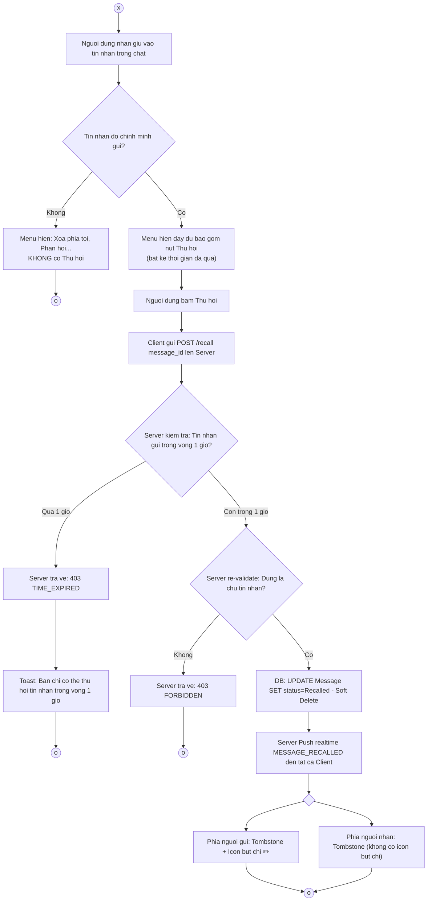
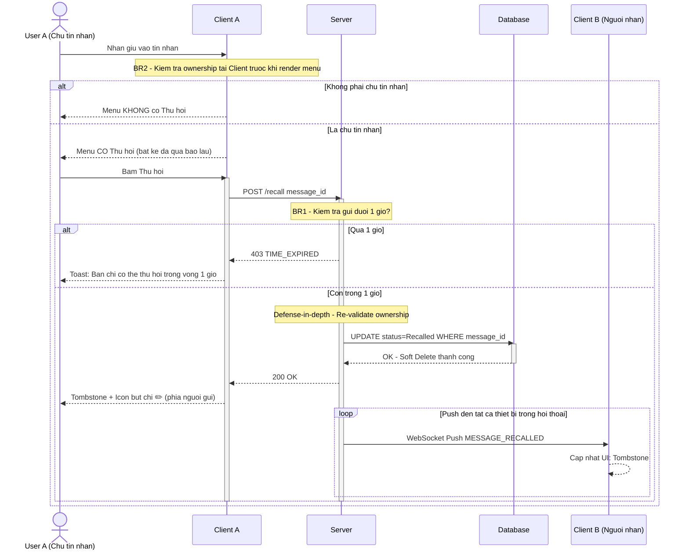
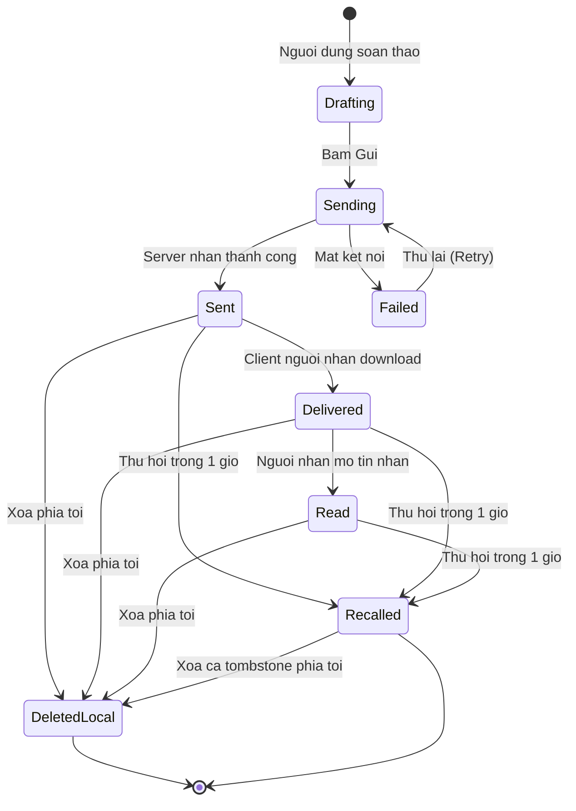

# DAC TA SO DO QUY TRINH & KIEN TRUC: THU HOI TIN NHAN ZALO

Tai lieu nay tong hop toan bo ma nguon Mermaid va dac ta ky thuat cho 3 so do cot loi trong Case Study phan tich tinh nang Thu hoi tin nhan tren Zalo.

---

## 1. Flowchart - Cay Quyet Dinh Thu Hoi

So do mo hinh hoa toan bo luong quyet dinh tu khi nguoi dung nhan giu vao tin nhan ket thuc ket thuc ket thuc ket thuc ket thuc ket thuc check quyen so huu tai Client ket thuc ket thuc check thoi gian tai Server ket thuc ket thuc Soft Delete ket thuc ket thuc Push realtime.

---

## 2. Sequence Diagram - Luong Ky Thuat Thu Hoi

So do mo ta chi tiet tung buoc giao tiep giua Actor, Client, Server va Database.

---

## 3. State Diagram - Vong Doi Trang Thai Tin Nhan

So do mo ta toan bo cac trang thai ma mot tin nhan tren Zalo co the di qua.

