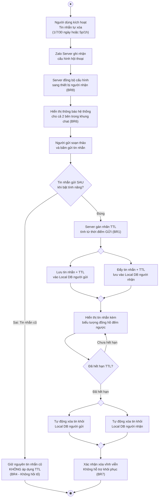
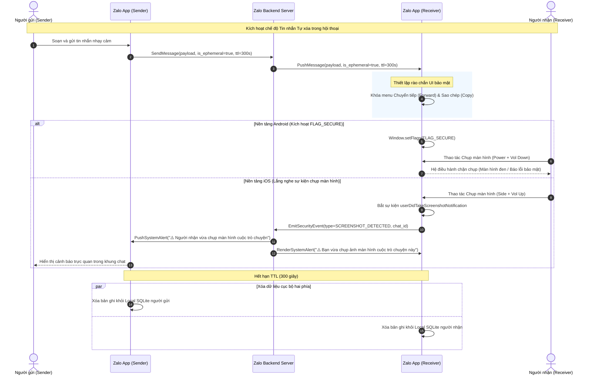
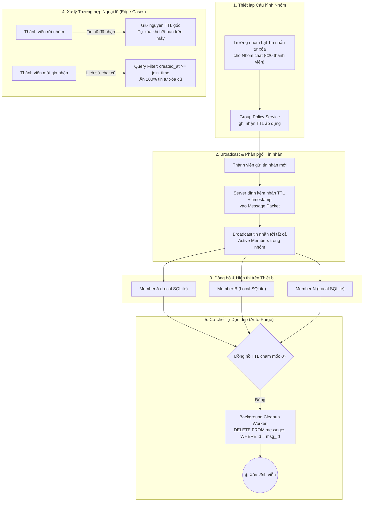

# ĐẶC TẢ SƠ ĐỒ QUY TRÌNH & KIẾN TRÚC: TIN NHẮN TỰ XÓA ZALO

Tài liệu này tổng hợp toàn bộ mã nguồn Mermaid và đặc tả kỹ thuật cho 3 sơ đồ cốt lõi trong Case Study Tối ưu Tính năng Tin nhắn Tự xóa trên Zalo.

---

## 1. Flowchart Vòng Đời Tin Nhắn Tự Xóa (End-to-End Lifecycle)

Sơ đồ mô hình hóa toàn diện luồng vận hành từ khi người dùng kích hoạt tính năng, đồng bộ cấu hình, gắn nhãn TTL, lưu trữ Local DB hai phía đến khi dọn dẹp xóa sạch dữ liệu vĩnh viễn.

---

## 2. Sequence Diagram Kiểm Soát Chụp Màn Hình & Chống Rò Rỉ (Anti-Leak Flow)

Sơ đồ đặc tả cơ chế phòng vệ rò rỉ đa tầng (PP3): xử lý chặn chụp màn hình trên Android (`FLAG_SECURE`) và cơ chế phát hiện / gửi thông báo cảnh báo leo thang trên iOS (`UIScreen.capturedDidChangeNotification`).

---

## 3. Solution Architecture Luồng Đồng Bộ TTL Cho Nhóm Chat (Group Ephemeral Flow)

Sơ đồ mô hình hóa kiến trúc phân tán đồng bộ thời gian sống (TTL) cho nhóm chat quy mô nhỏ (<20 thành viên), bao gồm cơ chế kiểm soát thành viên vào/rời nhóm để tránh rò rỉ dữ liệu lịch sử.

